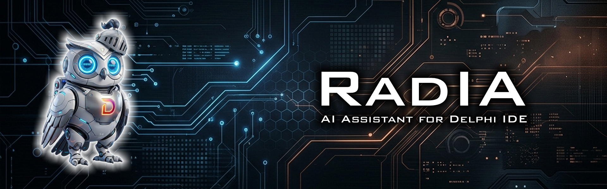
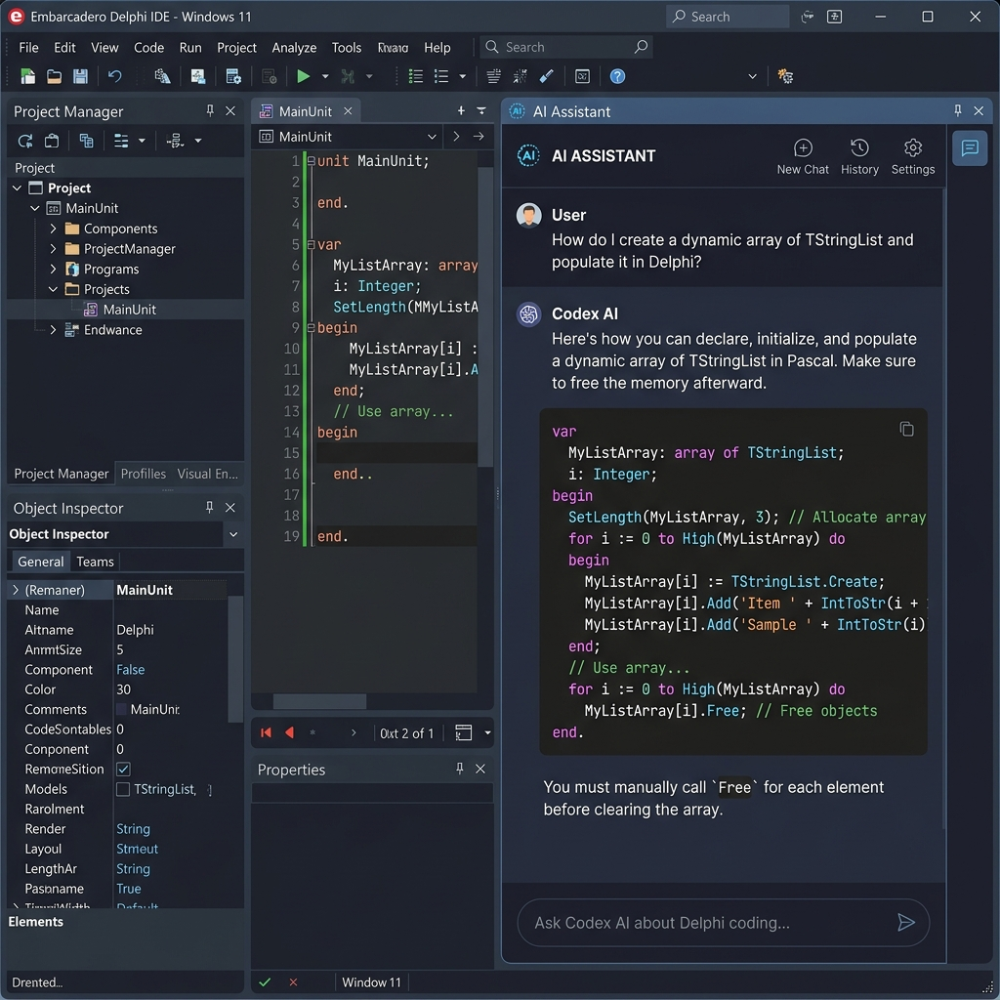

<div align="right">

[🇧🇷 Português](README.md) | [🇺🇸 English](README.en.md) | [🗺️ Roadmap](docs/roadmap.en.md) | [📋 Backlog](docs/backlog.en.md)

</div>

<p align="center">
  
</p>


# Rad IA - AI Assistant for Delphi IDE

**Rad IA** is an advanced AI assistant plugin designed specifically for the Embarcadero Delphi IDE (using the Open Tools API). It docks directly into the IDE sidebar, providing an interactive chat interface and deep contextual integration with the code editor to accelerate development, refactoring, and debugging.

<p align="center">
  
</p>

---

### 1. Development Guidelines and Language Standard

This project adopts clear language rules and design standards for both human developers and AI assistants (LLMs/Co-pilots) working on the codebase:

*   **AI & Human Interactions:**
    *   All chat interactions, pull request descriptions, task updates, and design discussions must be conducted in **Brazilian Portuguese (pt-BR)**.
    *   Commit messages must be written in **English (en-US)** following the [Commit Message Convention](docs/commit_convention.en.md).
*   **Source Code & Architecture:**
    *   The source code is **100% written in English (en-US)**.
    *   All identifiers (unit names, variables, classes, methods, records, enums), parameters, data structures (JSON/XML), and inline comments must be written exclusively in English, following object-oriented Pascal naming conventions.
    *   Strict adherence to **Clean Code**, **SOLID**, **DRY**, and **KISS** with complete thread-safety.
*   **Official Documentation:**
    *   Available primarily in Portuguese ([README.md](README.md)) with an English translation ([README.en.md](README.en.md)).

### 2. Features
*   **Dockable Sidebar Chat:** A native-looking, dockable panel integrated into the Delphi IDE with a quick-action welcome screen, IDE-aligned Dark/Light themes, and a high-fidelity web-rendered chat window (Edge/WebView2) with full Markdown rendering and Delphi syntax highlighting.
*   **Multi-Provider AI Support & Hybrid Connection:** Flexible hybrid connection model. Allows using your own API keys (BYOK) for **Google Gemini**, **OpenAI ChatGPT**, **Azure OpenAI**, **Anthropic Claude**, **AWS Bedrock**, **GitHub Copilot**, **DeepSeek**, **Groq**, **Alibaba Qwen**, **Mistral AI**, **OpenRouter**, **LM Studio**, and local **Ollama**, OR connecting directly to consumer personal/corporate accounts (**ChatGPT Plus/Pro** and **Gemini Advanced**) via official login inside WebView2, bypassing network blocks using smart DOM/CSS injection and JS-Delphi bridge.
*   **Native GitHub Copilot Integration:** Official support to connect directly to GitHub Copilot servers in the cloud (both personal and corporate subscriptions) with an integrated OAuth Device Flow and one-click importing of active VS Code credentials.
*   **Persistent Chat History:** Chat conversations are automatically saved locally in JSON format and can be loaded on demand from the welcome screen, avoiding chats being restored when the user does not need them.
*   **Shortcuts and Prompt History:** Integrated productivity shortcuts: use `Ctrl + Enter` to send prompts, `Enter` for line breaks, and keyboard arrows `↑` (up) and `↓` (down) inside the text input area to quickly cycle through previously typed and sent prompts.
*   **Context-Aware Editor Actions:** Right-click on any code selection to:
    *   *Explain Selected Code:* Analyze and explain the logic.
    *   *Optimize/Refactor:* Improve performance and apply clean code practices.
    *   *Generate Unit Tests:* Automatically output a DUnitX test structure.
    *   *Analyze for Bugs:* Scan selected block for memory leaks or logic errors.
    *   Menu-triggered commands preserve formatted Pascal blocks in chat and keep `/explain` separated from review flows.
*   **Interactive Smart Diff View:** View refactored code recommendations side-by-side (Original vs. Suggested) highlighting changes in red/green with a one-click **[Apply Changes]** button directly into the editor.
*   **Smart Build Debugger:** Context integration with the Delphi *Messages View*. Right-click on compilation errors to get instant AI fixes and solutions.
*   **Auto XML Documentation:** Automatically write Delphi-compliant XML help tags (`/// <summary>`) above methods.
*   **DTO and Model Converter:** Instantly generate Object Pascal classes (DTOs) or records from JSON payloads or SQL DDL scripts, with smart support for DEXT ORM, TMS Aurelius, REST.Json, and Vanilla Delphi.
*   **Customizable Slash Commands:** Run quick actions directly in the chat input (e.g., `/explain`, `/createprojectarch`). You can define new dynamic commands mapped to custom prompt templates in the plugin settings.
*   **Template Library & Backup:** Panel to manage reusable prompt templates with smart token replacement (`{code}`, `{specification}`) and built-in dialogs to export and import backups (JSON) with merge support.
*   **Secure API Key Registry Storage:** Keys are saved encrypted locally using the Windows Data Protection API (DPAPI) inside the Windows Registry.
*   **Request Cancellation and Action Locking:** A dynamic circular stop button integrated inside the prompt input aborts active requests instantly and safely. While processing, session actions, toolbar buttons, and chat switching are locked to preserve the active context.

### 2.1 Complete Feature Checklist

To check the development status, keyboard shortcuts, categories, and all integrated providers in detail, please refer to our:

👉 [**Complete Feature Checklist (docs/features.en.md)**](docs/features.en.md)

### 3. How It Works & Architecture
Rad IA is built entirely in Object Pascal (Delphi) using the **Open Tools API (OTA)** to interface with the IDE's editor services, message services, and theme services.
The user interface uses a hybrid architecture:
1.  **VCL Layout:** Handles the window docking, settings dialog, toolbars, registry storage, and integration actions.
2.  **Edge WebView2 Engine:** Displays the message history using local HTML5, CSS (incorporating glassmorphism/modern dark UI that adapts to the IDE theme), and JavaScript libraries (Prism.js and Marked.js) to render rich markdown and copyable code blocks without freezing the main IDE thread.
3.  **MVP (Model-View-Presenter) Pattern:** Presentation logic and flow coordination (such as sending messages, changing providers, and saving configuration) are completely decoupled from VCL forms and encapsulated in Presenters (`TChatPresenter` and `TConfigPresenter`), allowing UI components to act as passive Views.
4.  **Storage Abstraction (`ISettingsStorage`):** For better maintainability and testing isolation, the option persistence layer has been abstracted. In production, settings are stored in the Windows Registry (`TRegistrySettingsStorage`), while unit tests run against an in-memory storage (`TMemorySettingsStorage`), ensuring tests do not corrupt the developer's local registry keys.

### 4. Prerequisites
*   **IDE:** Embarcadero Delphi 10.4 Sydney, 11 Alexandria, 12 Athens, or 13 Florence (or newer).
*   **OS:** Windows 10 / 11 (64-bit).
*   **Web Engine:** *Microsoft Edge WebView2 Runtime* installed on the Windows system.
*   **API Keys:** Active developer keys or a local Ollama instance.

### 5. Installation and Configuration

Rad IA can be installed in two ways: **Automated via PowerShell** (recommended, supporting autodetect of multiple installed Delphi environments and interactive selection menu) or **manually through the IDE**. For detailed compilation, registry registration, and API key acquisition instructions for all providers or local Ollama usage, please refer to our:

The automated installer also synchronizes local WebView2 assets into `%APPDATA%\RadIA\Web` and clears the local cache while the IDE is closed, preventing Delphi 12/13 from loading stale JavaScript after updates.

👉 [**Complete Installation and Configuration Guide (docs/install_config.en.md)**](docs/install_config.en.md)

### 5.1 Adding a New AI Provider (Plugin Architecture)

Rad IA employs a metadata-driven provider registry system (`TProviderRegistry`). This allows developers to add new AI backends in a fully dynamic and decoupled manner. For a step-by-step tutorial on how to implement your provider class and perform auto-registration, please check our:

👉 [**Guide for Adding New Providers (docs/new_provider_guide.en.md)**](docs/new_provider_guide.en.md)

### 5.2 Using GitHub Copilot Remotely (Native - Phase 2) or via Local Proxy (Phase 1)

Rad IA supports direct and remote integration with **GitHub Copilot** on the cloud (no local proxies required) through the plugin settings, including an integrated PIN-based login (OAuth Device Flow) and one-click VS Code credential importing.

If you prefer to run a local proxy compatible with the OpenAI API (Phase 1), this also remains supported via dynamic JSON provider registration. For more details, check out:

👉 [**GitHub Copilot Configuration Guide (docs/copilot_proxy_guide.en.md)**](docs/copilot_proxy_guide.en.md)

### 5.3 User and Feature Reference Guides

To get the most out of Rad IA features in your daily development workflow, check our detailed reference guides:

*   👉 [**Editor Integration & Code Generation Guide (docs/user_guide_editor_generation.en.md)**](docs/user_guide_editor_generation.en.md): Context-aware editor actions, Smart Diff visual comparison, XML documentation, DTO converter, and full-project prompt generation.
*   👉 [**Diagnostics & Code Analysis Guide (docs/user_guide_diagnostics_analysis.en.md)**](docs/user_guide_diagnostics_analysis.en.md): Smart Build Debugger compilation assistance, call stack parsing via Stack Trace Assistant, and memory leak static auditing.
*   👉 [**Chat Panel & Session Management Guide (docs/user_guide_chat_sessions.en.md)**](docs/user_guide_chat_sessions.en.md): Input text shortcuts, prompt history navigation, persistent multi-sessions, and prompt template backups.
*   👉 [**Commit Message Convention (docs/commit_convention.en.md)**](docs/commit_convention.en.md): English commit message standard using prefixes like `feat`, `fix`, `docs`, `refactor`, and others.
*   👉 [**Release Finalization Process (docs/release_process.en.md)**](docs/release_process.en.md): Checklist to update versions, validate builds, merge `develop`/`main`, create tags, and clean up branches.

---

### 6. Repository Structure
```
PluginDelphiIA/
│
├── .github/                            # GitHub configurations and templates
│   ├── ISSUE_TEMPLATE/
│   │   ├── bug_report.md               # Bug report template (PT)
│   │   ├── bug_report.en.md            # Bug report template (EN)
│   │   ├── feature_request.md          # Feature request template (PT)
│   │   ├── feature_request.en.md       # Feature request template (EN)
│   │   └── config.yml                  # Template chooser configuration
│   └── pull_request_template.md        # Bilingual Pull Request template
│
├── docs/                               # Documentation and visual resources
│   ├── images/                         # UI screenshots and mockups
│   ├── backlog.md / backlog.en.md      # Kanban board and technical evolution backlog
│   ├── roadmap.md / roadmap.en.md      # Strategic milestones planning
│   ├── features.md / features.en.md    # Feature catalog and compatibility matrix
│   ├── install_config.md / .en.md      # Installation and API keys guide
│   ├── compliance.md / .en.md          # Legal notices, privacy, and compliance
│   ├── new_provider_guide.md / .en.md  # Guide to adding new providers
│   ├── user_guide_*.md                 # Detailed usage manuals (chat, editor, stack trace)
│
├── RadIA.groupproj                     # Delphi Project Group solution
├── RadIA.dpk                           # Delphi design-time package source (BPL)
├── RadIA.dproj                         # Delphi package project configurations
├── RadIA.rc                            # Resource script file
│
├── Source/                             # Core plugin source code
│   ├── Core/                           # Core units (interfaces, settings, DTOs)
│   ├── Providers/                      # AI API Clients (Gemini, OpenAI, Claude, Ollama)
│   ├── Integration/                    # ToolsAPI IDE integration (hooks, wizards, options)
│   └── UI/                             # VCL Forms, Frames, and dialog windows
│       └── Web/                        # Local HTML5/JS chat resources (WebView2)
│           └── vendor/                 # Third-party libraries (Prism, Marked, diff2html)
│
├── Tests/                              # DUnitX Integration and Unit Tests
│   └── Source/                         # Unit tests implementation files
│
├── .editorconfig                       # Formatting and line ending standards
├── agents.md                           # Guidelines and restrictions for AI agents (LLMs)
├── build.ps1                           # Automated build and installation script
├── eslint.config.js                    # ESLint Javascript linter settings
└── package.json                        # Node npm package dependencies and scripts
```

### 7. Terms of Use and Corporate Compliance

For guidelines on corporate compliance (GDPR/LGPD), data privacy, API key encryption using Windows DPAPI, and legal disclaimers regarding AI-generated code, please refer to our:

👉 [**Terms of Use, Compliance, and Privacy Guide (docs/compliance.en.md)**](docs/compliance.en.md)
