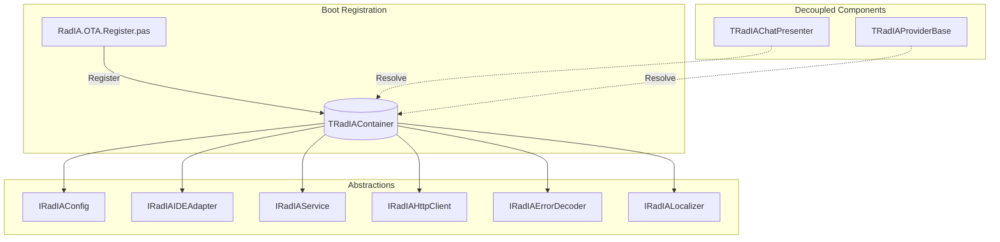
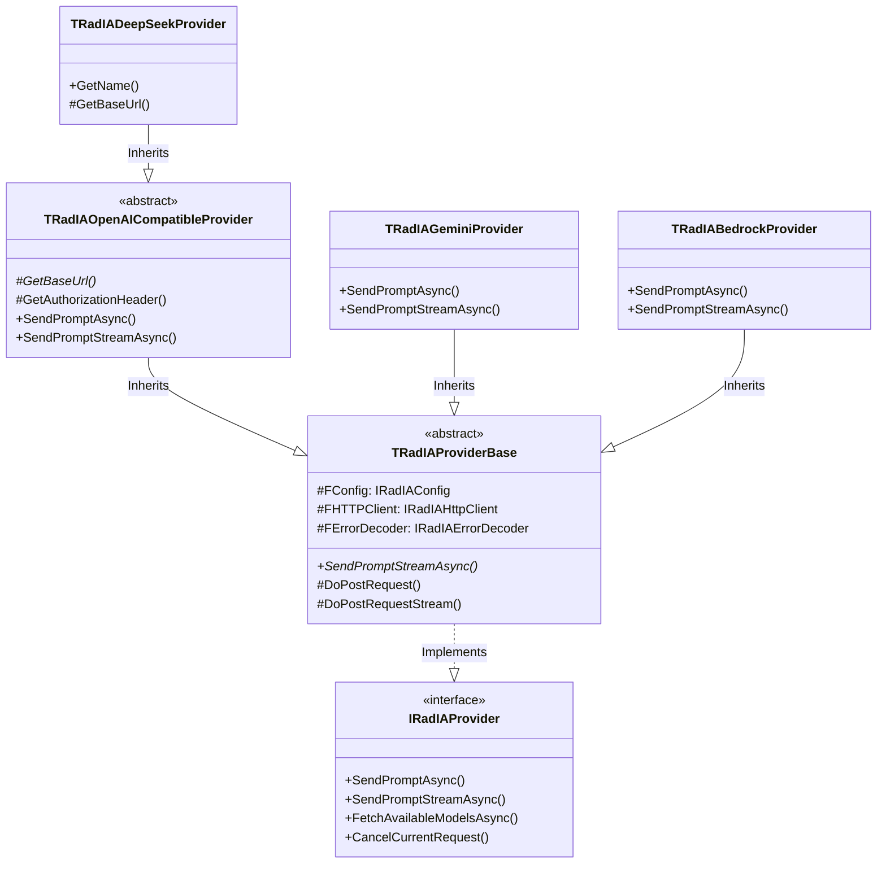
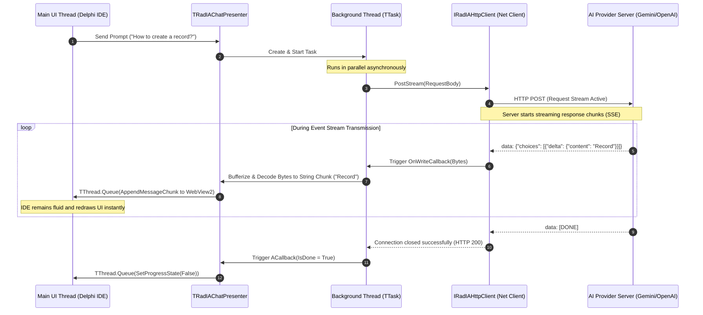

# Software Architecture Guide

This technical guide is intended for developers and software architects who want to understand the internal engineering, design patterns, concurrent workflows, and infrastructure of **Rad IA**. The plugin runs integrated into the main process of the Delphi IDE (`bds.exe`), which imposes strict memory management, thread safety, and lifecycle control constraints.

<p align="center">
  
</p>

---

## 1. Presentation Design Patterns (Model-View-Presenter - MVP)

Rad IA adopts the **Model-View-Presenter (MVP)** pattern in its *Passive View* variant to manage its screens (such as the chat panel and the configuration screen). This pattern isolates presentation logic from physical VCL components and WebView2, maximizing automated offline unit testability.

```mermaid
classDiagram
    direction LR
    class IRadIAChatView {
        <<interface>>
        +AppendMessage(role, content)
        +SetProgressState(active)
        +ClearChat()
    }
    class TRadIAFrameAIChat {
        <<VCL Frame>>
        -FPresenter: TRadIAChatPresenter
        +AppendMessage(role, content)
    }
    class TRadIAChatPresenter {
        -FView: IRadIAChatView
        -FService: IRadIAService
        +SendPrompt(prompt)
        +CancelRequest()
    end
    class IRadIAService {
        <<interface>>
        +SendPrompt(prompt, callback)
    end

    TRadIAFrameAIChat ..|> IRadIAChatView : Implements
    TRadIAChatPresenter --> IRadIAChatView : Interacts via
    TRadIAChatPresenter --> IRadIAService : Consumes
    TRadIAFrameAIChat --> TRadIAChatPresenter : Dispatches to
```

*   **View (Passive):** Interfaces like `IRadIAChatView` and `IRadIAConfigView` declare only display methods or elementary control state manipulation. The physical implementations (`TRadIAFrameAIChat` and `TRadIAFrameAIConfig`) make no business decisions; they merely forward button clicks or keyboard input to the Presenter.
*   **Presenter:** Classes like `TRadIAChatPresenter` and `TRadIAConfigPresenter` manage UI orchestration. They listen to View actions, resolve dynamic dependencies in the IoC container, interact with the core service, and update the View with the final result synchronously or asynchronously.
*   **Model:** Represented by data entities (like `TRadIAChatMessage` and cache records) and core services (`IRadIAService` and `TRadIASessionManager`).

---

## 2. Inversion of Control and Dependency Injection (DIP / IoC)

To avoid cross-coupling dependencies inside Delphi `uses` clauses (which would prevent isolated unit tests and offline network stubs), RadIA utilizes Inversion of Control (IoC) through a global, thread-safe static container (`TRadIAContainer` defined in `RadIA.Core.Container.pas`).

Container boot and automatic registration of all abstractions happen inside the wizard registration unit [RadIA.OTA.Register.pas](file:///d:/Projetos/PluginDelphiIA/Source/Integration/RadIA.OTA.Register.pas):



### Services Registered at Boot:
1.  **`IRadIAConfig`:** Centralized access to registry settings, active models, and secure Windows credentials (using DPAPI).
2.  **`IRadIALogger`:** Interface for log writing and monitoring.
3.  **`IRadIAIDEAdapter`:** Adapter encapsulating the Delphi IDE native APIs (Open Tools API). Enables offline stubs (like `TMockIDEAdapter`) to run tests outside the `bds.exe` process.
4.  **`IRadIAService`:** Main orchestrator for connections, history, and cache.
5.  **`IRadIATextNormalizer`:** Conversions utility to normalize editor line endings to CRLF (`#13#10`), fixing Delphi buffer bugs.
6.  **`IRadIAHttpClient`:** Abstraction of asynchronous HTTP REST requests wrapping the native `THTTPClient`.
7.  **`IRadIAErrorDecoder`:** Decoder for HTTP status errors and raw JSON error payloads from AI APIs.
8.  **`IRadIALocalizer`:** Localization (i18n) component to support multi-language strings in UI forms and alerts.

### General Dependency Diagram (Classes & Interfaces)

Below is the complete architectural mapping of the plugin's loose coupling. All dependencies between the UI (Presenter), business logic (Service, Config), and infrastructure (HttpClient, Storage, IDEAdapter) are sustained by interface contracts, enabling clean component mocking/stubbing in regression tests:

```mermaid
classDiagram
    direction TB

    %% Interfaces
    class IRadIAConfig {
        <<interface>>
    }
    class IRadIAIDEAdapter {
        <<interface>>
    }
    class IRadIAService {
        <<interface>>
    }
    class IRadIAProvider {
        <<interface>>
    }
    class IRadIAHttpClient {
        <<interface>>
    }
    class IRadIAErrorDecoder {
        <<interface>>
    }
    class IRadIALocalizer {
        <<interface>>
    }
    class IRadIASettingsStorage {
        <<interface>>
    }
    class IRadIAChatView {
        <<interface>>
    }

    %% Concrete Classes
    class TRadIAChatPresenter {
        -FView : IRadIAChatView
        -FService : IRadIAService
        -FConfig : IRadIAConfig
        -FLocalizer : IRadIALocalizer
    }
    class TRadIAFrameAIChat {
        -FPresenter : TRadIAChatPresenter
    }
    class TRadIAService {
        -FConfig : IRadIAConfig
        -FIDEAdapter : IRadIAIDEAdapter
        -FActiveProvider : IRadIAProvider
    }
    class TRadIAConfig {
        -FStorage : IRadIASettingsStorage
    }
    class TRadIAProviderBase {
        -FConfig : IRadIAConfig
        -FHTTPClient : IRadIAHttpClient
        -FErrorDecoder : IRadIAErrorDecoder
    }
    class TRadIAConcreteHttpClient {
        -FConfig : IRadIAConfig
    }
    class TRadIARegistrySettingsStorage {
    }
    class TRadIAConcreteIDEAdapter {
    }

    %% Implementation Relationships
    TRadIAFrameAIChat ..|> IRadIAChatView : Implements
    TRadIAService ..|> IRadIAService : Implements
    TRadIAConfig ..|> IRadIAConfig : Implements
    TRadIAProviderBase ..|> IRadIAProvider : Implements
    TRadIAConcreteHttpClient ..|> IRadIAHttpClient : Implements
    TRadIARegistrySettingsStorage ..|> IRadIASettingsStorage : Implements
    TRadIAConcreteIDEAdapter ..|> IRadIAIDEAdapter : Implements

    %% Association/Consumption Relationships
    TRadIAChatPresenter --> IRadIAChatView : Consumes
    TRadIAChatPresenter --> IRadIAService : Consumes
    TRadIAChatPresenter --> IRadIAConfig : Consumes
    TRadIAChatPresenter --> IRadIALocalizer : Consumes

    TRadIAService --> IRadIAConfig : Consumes
    TRadIAService --> IRadIAIDEAdapter : Consumes
    TRadIAService --> IRadIAProvider : Consumes

    TRadIAConfig --> IRadIASettingsStorage : Consumes

    TRadIAProviderBase --> IRadIAConfig : Consumes
    TRadIAProviderBase --> IRadIAHttpClient : Consumes
    TRadIAProviderBase --> IRadIAErrorDecoder : Consumes

    TRadIAConcreteHttpClient --> IRadIAConfig : Consumes
```



---

## 3. AI Providers Architecture (Polymorphism and SRP)

Support for multiple AI backends (Gemini, OpenAI, Claude, DeepSeek, Ollama, etc.) is supported by a strict polymorphic hierarchy. The core service (`IRadIAService`) operates in a fully provider-agnostic manner, communicating exclusively through the `IRadIAProvider` interface.



### Decoupled Connectivity and Error Handling:
*   **`IRadIAHttpClient`:** Encapsulates socket connection management, timeouts, and streaming data bytes. Providers do not instantiate the native `THTTPClient` class, preventing socket leaks and simplifying API integration tests with stubs.
*   **`IRadIAErrorDecoder`:** Standardizes API error parsing. When an HTTP error occurs (e.g. status 401 or 429), the network client raises `ERadIAHttpException`, which is caught and decoded by `IRadIAErrorDecoder` into a user-friendly error message.

---

## 4. Concurrent Workflows and Thread Safety in the IDE

Since the Delphi IDE (`bds.exe`) is fundamentally a single-threaded GUI application (with the main UI thread managing editor buffer rendering, paint loops, and compilation), **blocking operations such as HTTP network calls would freeze the IDE instantly**.

Thus, Rad IA executes all remote API calls in secondary background threads (using `TTask` from the Delphi *Parallel Programming Library*).

### Asynchronous Communication Sequence Flow (Stream SSE):



### UI Synchronization Constraints:
Any direct access to VCL frames, forms, or WebView2 components from the background thread (steps 9 and 12) **must** be queued back to the main UI thread using `TThread.Queue` or `TThread.Synchronize`. Otherwise, VCL memory state becomes corrupted, causing instant IDE freezes or Access Violations in `rtl290.bpl`.

---

## 5. Lifecycle Management and IDE Shutdown Guard

Rad IA runs as a dynamically linked package (BPL). If the IDE is closed while background connection threads are active, severe Access Violations can occur on exit.

To prevent this, three safety guardrails are implemented:

1.  **Global `GIsShuttingDown` Flag:**
    Defined in `RadIA.Core.Types.pas`. When the IDE starts the shutdown sequence (`TRadIAWizard.Destroy` runs on the main thread), this flag is set to `True`.
2.  **Early HTTP Abort Check:**
    The concrete client callback (`HTTPClientReceiveData`) checks `FCancelled` and `GIsShuttingDown` continuously. If either is `True`, it sets `AAbort := True` on the native socket connection, terminating the request and the thread instantly.
3.  **WebView2 Safe Disposal:**
    Disposing WebView2 (`TEdgeBrowser`) synchronously during shutdown causes deadlocks due to COM messaging loops being disabled. When `GIsShuttingDown` is `True`, the parent form sets `EdgeBrowser.Parent := nil` without freeing the component. Windows automatically handles clean up for child processes when `bds.exe` terminates.
