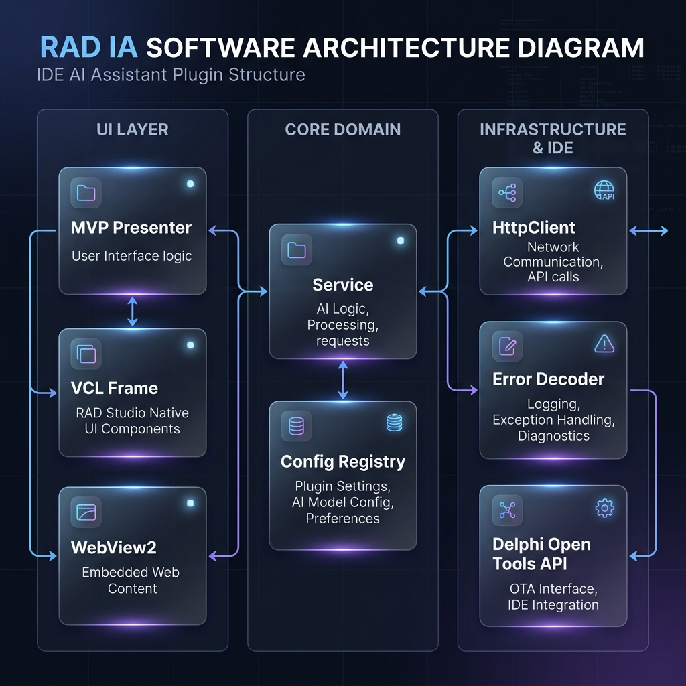
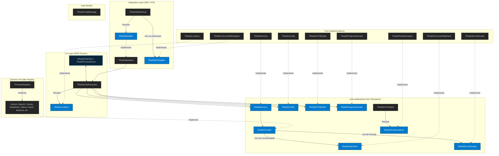
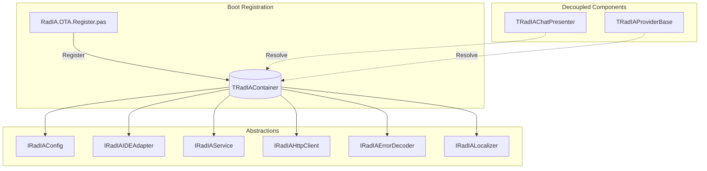
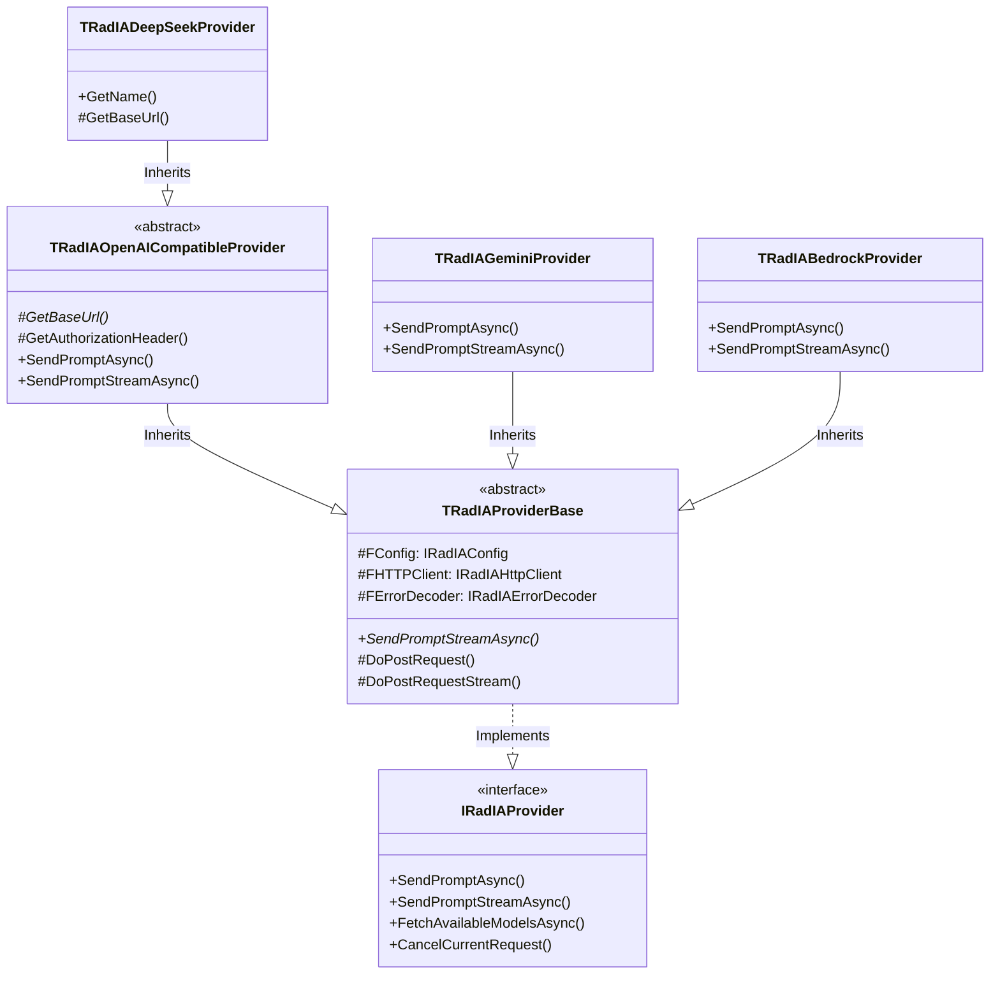
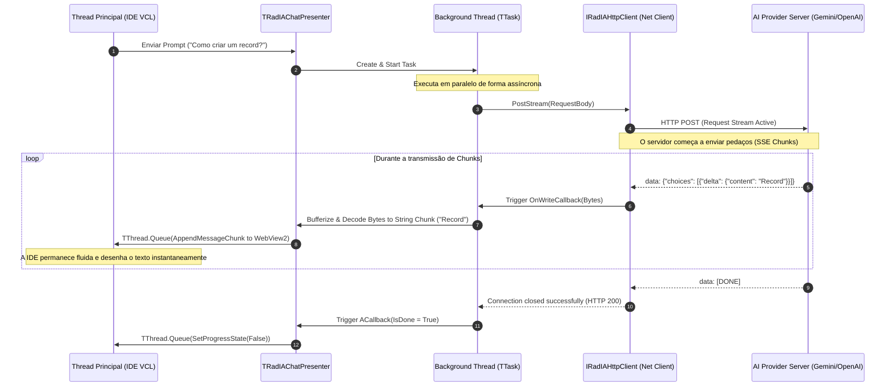

# Guia de Arquitetura de Software do Rad IA

Este guia técnico destina-se a desenvolvedores e arquitetores de software que desejam compreender a engenharia interna, os padrões de design, os fluxos concorrentes e a infraestrutura do **Rad IA**. O plugin roda integrado ao processo principal da IDE do Delphi (`bds.exe`), o que impõe restrições severas de gerenciamento de memória, segurança concorrente (thread safety) e controle de ciclo de vida.

<p align="center">
  
</p>

---

## Visão Geral da Arquitetura de Camadas

A arquitetura do Rad IA está organizada em camadas bem definidas e fracamente acopladas, garantindo o isolamento entre lógicas de apresentação visual, integrações com a IDE, regras de negócio e infraestrutura de rede, erros e internacionalização:



---

## 1. Padrões de Design de Apresentação (Model-View-Presenter - MVP)

O Rad IA adota o padrão de design **Model-View-Presenter (MVP)** na variante *Passive View* para gerenciar suas telas (como o painel de chat e a tela de configurações). Esse padrão isola a lógica de controle visual da infraestrutura de componentes VCL e WebView2, maximizando a testabilidade unitária automatizada de forma offline.

```mermaid
classDiagram
    direction LR
    class IRadIAChatView {
        <<interface>>
        +AppendMessage(role, content)
        +SetProgressState(active)
        +ClearChat()
    }
    class TRadIAFrameAIChat {
        <<VCL Frame>>
        -FPresenter: TRadIAChatPresenter
        +AppendMessage(role, content)
    }
    class TRadIAChatPresenter {
        -FView: IRadIAChatView
        -FService: IRadIAService
        +SendPrompt(prompt)
        +CancelRequest()
    end
    class IRadIAService {
        <<interface>>
        +SendPrompt(prompt, callback)
    end

    TRadIAFrameAIChat ..|> IRadIAChatView : Implements
    TRadIAChatPresenter --> IRadIAChatView : Interacts via
    TRadIAChatPresenter --> IRadIAService : Consumes
    TRadIAFrameAIChat --> TRadIAChatPresenter : Dispatches to
```

*   **View (Passiva):** Interfaces como `IRadIAChatView` e `IRadIAConfigView` declaram apenas métodos de exibição de dados ou manipulação elementar de estado de componentes. As implementações físicas (`TRadIAFrameAIChat` e `TRadIAFrameAIConfig`) não tomam decisões de negócio; apenas repassam cliques de botões ou entradas de teclado para o Presenter.
*   **Presenter:** Classes como `TRadIAChatPresenter` e `TRadIAConfigPresenter` contêm toda a coordenação do fluxo de UI. Elas ouvem as ações da View, resolvem dependências dinâmicas no container IoC, interagem com o serviço central e atualizam a View com o resultado final de forma síncrona ou assíncrona.
*   **Model:** Representado pelas entidades de dados (como `TRadIAChatMessage` e registros de cache) e pelos serviços centrais (`IRadIAService` e `TRadIASessionManager`).

---

## 2. Inversão de Controle e Injeção de Dependências (DIP / IoC)

Para evitar dependências cruzadas acopladas estaticamente na cláusula `uses` do Delphi (que impediriam testes unitários isolados e stubs de rede), o Rad IA utiliza Inversão de Controle (IoC) por meio de um container estático thread-safe (`TRadIAContainer` localizado em `RadIA.Core.Container.pas`).

O boot do container e o auto-registro de todas as abstrações ocorrem na unit de inicialização [RadIA.OTA.Register.pas](file:///d:/Projetos/PluginDelphiIA/Source/Integration/RadIA.OTA.Register.pas):



### Serviços Registrados no Boot:
1.  **`IRadIAConfig`:** Fornece acesso centralizado aos parâmetros do registro, modelos ativos e credenciais seguras do Windows (via DPAPI).
2.  **`IRadIALogger`:** Interface de geração de logs de monitoramento.
3.  **`IRadIAIDEAdapter`:** Adaptador que encapsula as chamadas de API nativas da IDE do Delphi (Open Tools API). Permite stubs stethoscópicos offline (como `TMockIDEAdapter`) para executar testes fora do processo `bds.exe`.
4.  **`IRadIAService`:** Orquestrador principal de conexões, histórico e caching de conversas.
5.  **`IRadIATextNormalizer`:** Conversor universal que normaliza quebras de linha de código para CRLF (`#13#10`), sanando bugs de buffers da IDE.
6.  **`IRadIAHttpClient`:** Abstração de requisições REST HTTP assíncronas do `THTTPClient`.
7.  **`IRadIAErrorDecoder`:** Decodificador de erros de servidores HTTP e payloads de falha das IAs.
8.  **`IRadIALocalizer`:** Componente de internacionalização (i18n) para localização de strings da UI.

### Diagrama de Dependências Geral (Classes & Interfaces)

Abaixo é apresentado o mapeamento completo do acoplamento flexível do plugin. Todas as dependências entre a UI (Presenter), lógica de negócios (Service, Config) e infraestrutura (HttpClient, Storage, IDEAdapter) são sustentadas por contratos de interfaces, permitindo a substituição de qualquer componente por stubs de simulação nos testes de regressão:

```mermaid
classDiagram
    direction TB

    %% Interfaces
    class IRadIAConfig {
        <<interface>>
    }
    class IRadIAIDEAdapter {
        <<interface>>
    }
    class IRadIAService {
        <<interface>>
    }
    class IRadIAProvider {
        <<interface>>
    }
    class IRadIAHttpClient {
        <<interface>>
    }
    class IRadIAErrorDecoder {
        <<interface>>
    }
    class IRadIALocalizer {
        <<interface>>
    }
    class IRadIASettingsStorage {
        <<interface>>
    }
    class IRadIAChatView {
        <<interface>>
    }

    %% Classes Concretas
    class TRadIAChatPresenter {
        -FView : IRadIAChatView
        -FService : IRadIAService
        -FConfig : IRadIAConfig
        -FLocalizer : IRadIALocalizer
    }
    class TRadIAFrameAIChat {
        -FPresenter : TRadIAChatPresenter
    }
    class TRadIAService {
        -FConfig : IRadIAConfig
        -FIDEAdapter : IRadIAIDEAdapter
        -FActiveProvider : IRadIAProvider
    }
    class TRadIAConfig {
        -FStorage : IRadIASettingsStorage
    }
    class TRadIAProviderBase {
        -FConfig : IRadIAConfig
        -FHTTPClient : IRadIAHttpClient
        -FErrorDecoder : IRadIAErrorDecoder
    }
    class TRadIAConcreteHttpClient {
        -FConfig : IRadIAConfig
    }
    class TRadIARegistrySettingsStorage {
    }
    class TRadIAConcreteIDEAdapter {
    }

    %% Relacionamentos de Implementação
    TRadIAFrameAIChat ..|> IRadIAChatView : Implementa
    TRadIAService ..|> IRadIAService : Implementa
    TRadIAConfig ..|> IRadIAConfig : Implementa
    TRadIAProviderBase ..|> IRadIAProvider : Implementa
    TRadIAConcreteHttpClient ..|> IRadIAHttpClient : Implementa
    TRadIARegistrySettingsStorage ..|> IRadIASettingsStorage : Implementa
    TRadIAConcreteIDEAdapter ..|> IRadIAIDEAdapter : Implementa

    %% Relacionamentos de Associação/Consumo
    TRadIAChatPresenter --> IRadIAChatView : Consome
    TRadIAChatPresenter --> IRadIAService : Consome
    TRadIAChatPresenter --> IRadIAConfig : Consome
    TRadIAChatPresenter --> IRadIALocalizer : Consome

    TRadIAService --> IRadIAConfig : Consome
    TRadIAService --> IRadIAIDEAdapter : Consome
    TRadIAService --> IRadIAProvider : Consome

    TRadIAConfig --> IRadIASettingsStorage : Consome

    TRadIAProviderBase --> IRadIAConfig : Consome
    TRadIAProviderBase --> IRadIAHttpClient : Consome
    TRadIAProviderBase --> IRadIAErrorDecoder : Consome

    TRadIAConcreteHttpClient --> IRadIAConfig : Consome
```



---

## 3. Arquitetura de Provedores de IA (Polimorfismo e SRP)

O suporte a múltiplos provedores de inteligência artificial (Gemini, OpenAI, Claude, DeepSeek, Ollama, etc.) é sustentado por uma hierarquia polimórfica estrita. O serviço central (`IRadIAService`) opera de forma totalmente agnóstica a provedores concretos, comunicando-se exclusivamente com a interface `IRadIAProvider`.



### Abstração de Conectividade de Rede e Tratamento de Erros:
*   **`IRadIAHttpClient`:** Encapsula todo o gerenciamento de sockets, timeouts de conexão e a mecânica assíncrona de streaming de dados. Os provedores não criam instâncias do `THTTPClient` físico, o que previne vazamentos de conexões e facilita mocks de tráfego de rede nos testes de integração.
*   **`IRadIAErrorDecoder`:** Padroniza as mensagens de erro. Se o servidor retornar um status code de erro (ex: 401 ou 429), a exceção é capturada pela classe de infraestrutura HTTP, empacotada em uma `ERadIAHttpException`, decodificada de forma amigável pelo `IRadIAErrorDecoder` e exibida de forma clara ao usuário.

---

## 4. Concorrência e Multithreading Segura na IDE (Thread Safety)

Como a IDE do Delphi (`bds.exe`) é um aplicativo de thread única (a thread principal de UI gerencia todo o editor de código, repintura de tela e compilação), **qualquer operação síncrona demorada de rede congelaria instantaneamente a IDE**.

Por isso, o Rad IA executa todas as chamadas de rede às APIs de IA em threads de background secundárias (via `TTask` da *Parallel Programming Library* do Delphi).

### Fluxo de Sequência de Comunicação Assíncrona (Stream SSE):



### Pontos de Sincronização Obrigatórios com a UI:
Qualquer acesso ou manipulação direta de frames visuais VCL ou componentes Edge WebView2 a partir da background thread (passo 9 e 12) **deve** ser executado por meio de `TThread.Queue` ou `TThread.Synchronize` para sincronizar os dados de volta com o loop de mensagens da thread principal. Falhar em fazer isso corrompe a memória de renderização da VCL, gerando travamentos imediatos ou Access Violations em `rtl290.bpl`.

---

## 5. Gerenciamento de Ciclo de Vida e Controle de Shutdown da IDE

O Rad IA funciona como um pacote acoplado dinamicamente (BPL). Se a IDE for fechada pelo usuário enquanto houver background threads de IA ativas ou conexões pendentes de rede, isso pode gerar Access Violations gravíssimos.

Para resolver isso, o Rad IA implementa três regras fundamentais de ciclo de vida:

1.  **A Flag Global `GIsShuttingDown`:**
    Declarada em `RadIA.Core.Types.pas`. Quando a IDE inicia o encerramento do processo (`TRadIAWizard.Destroy` é executado na thread principal), essa flag é marcada como `True`.
2.  **Aborto Rápido no `IRadIAHttpClient`:**
    O callback do cliente de rede concreto (`HTTPClientReceiveData`) lê atômica e continuamente as flags `FCancelled` e `GIsShuttingDown`. Se alguma delas for `True`, ele força a variável `AAbort := True` no barramento HTTP nativo do Delphi, interrompendo imediatamente o socket ativo de rede e terminando a thread.
3.  **Supressão de Destruição do WebView2 no Shutdown:**
    O componente `TEdgeBrowser` (WebView2) interage com a COM do Windows. No shutdown da IDE, tentar liberar o componente ativamente via `.Free` causa deadlocks COM graves de travamento. O Rad IA verifica `GIsShuttingDown`: se for `True`, ele desassocia visualmente o componente (`Parent := nil`) e deixa a memória e os subprocessos `msedgewebview2.exe` serem desalocados automaticamente de forma robusta pelo Windows ao encerrar o processo pai `bds.exe`.
