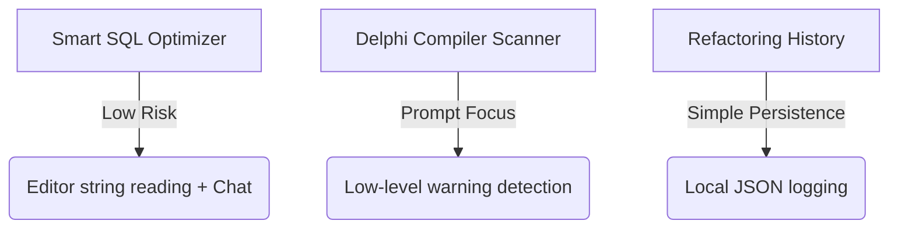

# Rad IA - Feature Prioritization and Feasibility Matrix

This document presents a technical and business analysis comparing **13 new feature ideas** with **7 features already present in the project backlog/roadmap** of the Rad IA project.

The analysis is structured from the perspective of a **Senior Software Architect**, evaluating the complexity of implementation in the Embarcadero Delphi ecosystem (using the Open Tools API and Windows) against the impact generated in the daily life of the developer.

---

## 📊 Prioritization Matrix (Effort vs. Impact)

The table below crosses **Effort (Difficulty)** with **Impact (Benefit)** to help guide future development decisions:

| Feature | Source | Difficulty (Effort) | Benefit (Impact) | Category |
| :--- | :--- | :--- | :--- | :--- |
| **1. Smart SQL Optimizer in Editor** | New | 🟢 Low | 🔴 High | **Quick Win** |
| **2. Delphi Compiler & OS Warning Scanner** | New | 🟢 Low | 🔴 High | **Quick Win** |
| **3. Applied Refactoring History** | Backlog | 🟢 Low | 🟡 Medium | **Support Task** |
| **4. Uses Clause Optimizer (Clean Uses)** | New | 🟡 Medium | 🔴 High | **Main Project** |
| **5. Mock Generator for Unit Tests** | New | 🟡 Medium | 🔴 High | **Main Project** |
| **6. Smart Multi-Unit Trace Resolver** | New | 🟡 Medium | 🔴 High | **Main Project** |
| **7. MadExcept / EurekaLog Context Extractor** | New | 🟡 Medium | 🔴 High | **Main Project** |
| **8. Automatic Code Review on Save** | Backlog | 🟡 Medium | 🔴 High | **Main Project** |
| **9. Version Migration Assistant (Smart Migrate)** | Backlog | 🟡 Medium | 🔴 High | **Main Project** |
| **10. OpenAPI/Swagger Documentation Generator** | New | 🟡 Medium | 🔴 High | **Main Project** |
| **11. Bidirectional Semantic Analysis (DFM vs PAS)** | New | 🟡 Medium | 🟡 Medium-High | **Main Project** |
| **12. Project Docs Generation (API.md)** | Backlog | 🟡 Medium | 🟡 Medium-High | **Main Project** |
| **13. Cache Management Panel** | Backlog | 🟡 Medium | 🟡 Medium | **Support Task** |
| **14. BDE/ADO/dbExpress ➔ DEXT with FireDAC Conversion** | New | 🔴 High | 🔴 High | **Strategic Bet** |
| **15. Legacy Form Decomposer (Code-Behind)** | New | 🔴 High | 🔴 High | **Strategic Bet** |
| **16. Threads and PPL Assistant** | New | 🔴 High | 🔴 High | **Strategic Bet** |
| **17. Automatic Internationalization (i18n)** | New | 🔴 High | 🔴 High | **Strategic Bet** |
| **18. Inline Autocomplete (Ghost Text)** | Backlog | 🔴 High | 🔴 High | **Strategic Bet** |
| **19. IDE Debugger Integration (OTA)** | Backlog | 🔴 High | 🔴 High | **Strategic Bet** |
| **20. Native macOS/Linux Support (Lazarus)** | Backlog | 🔴 High | 🟡 Low-Medium | **Discard/Long Term** |

---

## 🟢 1. Difficulty Level: Low (Reduced Effort)

Features that do not demand complex low-level integrations with the Delphi editor, debugger APIs, or heavy file system manipulations. They focus on processing user text input or capturing simple selections via the Open Tools API.

### 1.1. Smart SQL Optimizer in Editor (New)
* **Benefit:** **High**. Prevents hidden SQL syntax errors inside strings and improves query performance before committing.
* **Complexity:** **Low**. The plugin reads the current line or selected block of text containing SQL commands through the Open Tools API, sends it to the AI for validation according to the selected database dialect, and returns optimization suggestions in the sidebar chat.

### 1.2. Delphi Compiler & OS Warning Scanner (New)
* **Benefit:** **High**. Prevents silent bugs in the Delphi ecosystem (e.g., visual call freezes without thread synchronization, Unicode string conflicts, Windows handle leaks).
* **Complexity:** **Low**. Mainly consists of developing structured prompt templates for the static analysis executed under the `/bugs` command, instructing the AI to focus specifically on known runtime and VCL compiler traps.

### 1.3. Applied Refactoring History (Backlog - v0.1.0)
* **Benefit:** **Medium**. Provides internal traceability and auditability, allowing the developer to see and undo edits the AI made directly through the editor.
* **Complexity:** **Low**. Consists of logging incremental records containing `Date`, `File`, `Previous Code`, and `New Code` in a local JSON directory (e.g., `%APPDATA%\RadIA\history\`) on each click of the **[Apply Changes]** button.

---

## 🟡 2. Difficulty Level: Medium (Moderate Effort)

Features that involve structural manipulation of Object Pascal code (rewriting complex strings, uses clauses, interfaces), hooks into standard IDE events, or additional configuration interfaces.

### 2.1. Uses Clause Optimizer (Clean Uses) (New)
* **Benefit:** **High**. Keeps units clean of orphaned imports, optimizing compilation and reducing accumulated technical debt.
* **Complexity:** **Medium**. Requires scanning the `uses` clauses and cross-referencing dependencies (data types and method calls used in the unit body). AI is excellent at this type of context cross-referencing without requiring a full AST parser implemented in Delphi.

### 2.2. Mock Generator for Unit Tests (New)
* **Benefit:** **High**. Facilitates the adoption of unit testing in Delphi, allowing developers to isolate coupled components that depend on databases or external connections.
* **Complexity:** **Medium**. Uses Rad IA's existing test generation base. The AI maps class dependencies (constructor interfaces) and generates mock code (compatible with Delphi-Mocks or manual interfaces) inside the test repository.

### 2.3. Smart Multi-Unit Trace Resolver (New)
* **Benefit:** **High**. Resolves complex runtime exceptions spanning multiple layers (Controller, Service, Repository) by automatically reading the physical files referenced in the log and providing global context to the AI.
* **Complexity:** **Medium**. Delphi's OTA allows tracing and reading the source code of any file linked to the active project. Rad IA parses the stack trace lines, loads the specific units in the background, and injects them structurally into the AI context.

### 2.4. MadExcept / EurekaLog Context Extractor (New)
* **Benefit:** **High**. The AI gains "runtime visibility," analyzing exceptions based on the actual values of local variables and objects collected by the error log at the exact moment of the crash.
* **Complexity:** **Medium**. Requires creating regex routines to extract the list and state of variables from crash logs and format them for the AI as prompt metadata.

### 2.5. Automatic Code Review on Save (Backlog - v0.1.0)
* **Benefit:** **High**. Ensures that best practices (Clean Code/SOLID) are analyzed continuously without manual action from the developer.
* **Complexity:** **Medium**. Needs to intercept the IDE save event (`IOTAModuleNotifier.AfterSave`), collect changes, and send a silent background request. The challenge is not blocking the save process and displaying alert messages unobtrusively in the Rad IA panel.

### 2.6. Version Migration Assistant (Smart Migrate) (Backlog - v0.2.0)
* **Benefit:** **High**. Drastically accelerates the modernization of legacy projects (Delphi 7/XE to Delphi 10.4/11/12/13), handling Unicode strings, legacy network calls, and obsolete library replacement.
* **Complexity:** **Medium**. Operates similarly to existing refactoring features, using templates and prompts focused on modern Delphi standards.

### 2.7. OpenAPI/Swagger Documentation Generator (New)
* **Benefit:** **High**. Essential for backend teams using Delphi with Horse or RAD Server, saving days of manual specification writing.
* **Complexity:** **Medium**. Rad IA needs to scan registered routes in controller classes or API initialization units, read referenced DTO structures, and compile the Swagger configuration file (JSON/YAML).

### 2.8. Bidirectional Semantic Analysis (DFM vs PAS) (New)
* **Benefit:** **Medium-High**. Removes accumulated cruft in legacy forms (invisible declarations of deleted components and orphan events).
* **Complexity:** **Medium**. Involves cross-reading the `.dfm` file (in text mode) and the `.pas` unit, identifying components instantiated in the DFM that have no active reference or handler in the source code.

### 2.9. Project Documentation Generation (Backlog - v0.3.0+)
* **Benefit:** **Medium-High**. Generates architectural summaries and maps project units into a centralized documentation file (e.g., `docs/API.md`).
* **Complexity:** **Medium**. The AI analyzes the folder structure of the active project, reads main class headers (`/// 
`), and generates a structured Markdown file.

### 2.10. Cache Management Panel (Backlog - v0.2.0)
* **Benefit:** **Medium**. Helps manage costs and debug cached AI responses locally.
* **Complexity:** **Medium**. Requires creating a standard VCL window in `Source/UI/` that lists cached items and allows individual or full deletion.

---

## 🔴 3. Difficulty Level: High (Elevated Effort / Risk)

Features that deeply modify the structure of multiple files simultaneously (DFM + PAS), require complex concurrency handling (multithreading), depend on intrusive editor UI engineering, or involve cross-platform ports.

### 3.1. BDE/ADO/dbExpress ➔ DEXT with FireDAC Conversion (New)
* **Benefit:** **High**. Complete database access modernization. Instead of just replacing query components, migrates the entire coupled relational model to a high-productivity ORM (DEXT ORM) using FireDAC as the physical transport layer.
* **Complexity:** **High**.
  * **In the DFM:** Map and remove legacy queries and tables (e.g., `TTable`, `TQuery`, `TSQLQuery`, `TADOQuery`), and clean up legacy connections (`TSQLConnection`, `TDatabase`, `TADOConnection`).
  * **In the PAS (Code):** The AI must rewrite all references that manipulated datasets manually (like `FieldByName`, `Next`, `Eof`, `Post`) and replace them with DEXT ORM's object-oriented syntax (e.g., `TDext.Save()`, local entity mapping, loops over typed lists of objects).
  * **Challenge:** The AI must generate new mapped Entity classes and insert them into the active project, ensuring that visual couplings (like `TDataSource` connected to screen controls) are converted to modern LiveBindings or manual binding.

### 3.2. Legacy Form Decomposer (Code-Behind Extractor) (New)
* **Benefit:** **High**. Solves one of the biggest architectural pain points in the Delphi community.
* **Complexity:** **High**. Requires surgical modifications: removing methods and references in the original `.pas` file, altering property and event binding in the `.dfm`, creating a new unit containing the extracted logic, and registering the imports in the source unit without breaking compilation.

### 3.3. Threads and PPL Assistant (New)
* **Benefit:** **High**. Makes Delphi applications responsive, avoiding UI freezes that ruin user experience.
* **Complexity:** **High**. The AI must identify all dependencies of the original synchronous block that interact with visual components and rewrite the code, wrapping the flow in `TTask.Run`. The biggest challenge is ensuring that the AI does not introduce memory leaks and race conditions in thread synchronizations.

### 3.4. Automatic Internationalization (i18n Wizard) (New)
* **Benefit:** **High**. Opens international markets for legacy software in Delphi.
* **Complexity:** **High**. Requires scanning both the DFM (to translate Captions, Hints, and static labels) and the PAS (to find hardcoded strings in ShowMessage, error messages, and exceptions). The plugin must create the external localization file and inject translation functions in runtime across hundreds of locations without introducing syntax bugs.

### 3.5. Inline Autocomplete (Ghost Text) (Backlog - v0.3.0+)
* **Benefit:** **High**. Provides the premium experience of real-time inline code copilot suggestions (similar to VS Code) inside the Delphi editor.
* **Complexity:** **Very High**. Delphi's Open Tools API (OTA) **does not provide native support** for drawing inline ghost text. Implementing this requires advanced and risky Win32 Windows techniques, such as window subclassing, Win32 message hooking, and GDI / Direct2D paint hooks on the IDE editor window.

### 3.6. IDE Debugger Integration (OTA) (Backlog - v0.3.0+)
* **Benefit:** **High**. Runtime fault analysis at the exact moment they occur in debug mode.
* **Complexity:** **High**. Requires registering and monitoring complex and sensitive IDE debugger callbacks via `IOTADebuggerNotifier`. Any failure or latency here can crash the debugger or cause Access Violations in the IDE (`bds.exe`).

### 3.7. Native macOS/Linux Support (Lazarus/FPC) (Backlog - v0.3.0+)
* **Benefit:** **Low-Medium**. Would expand Rad IA's reach to Lazarus and Free Pascal developers.
* **Complexity:** **Very High**. The UI, editor integration, and persistence layer of Rad IA are strictly tied to Delphi VCL, the proprietary Embarcadero ToolsAPI, and Microsoft's Edge WebView2 engine. Porting would require rewriting the UI in LCL and replacing the web engine.

---

> [!TIP]
> **Recommended Next Steps:**
> Rad IA's strategic focus should be on implementing **Quick Wins** (Smart SQL Optimizer and Delphi Compiler Scanner), as they deliver immediate value with minimal risk of regressions. In parallel, we can plan the incremental development of Medium effort **Main Projects** (such as Uses Clause Optimization, Smart Multi-Unit Trace Resolver, and Auto Code Review on Save), consolidating assistant robustness before tackling complex DFM refactorings.
