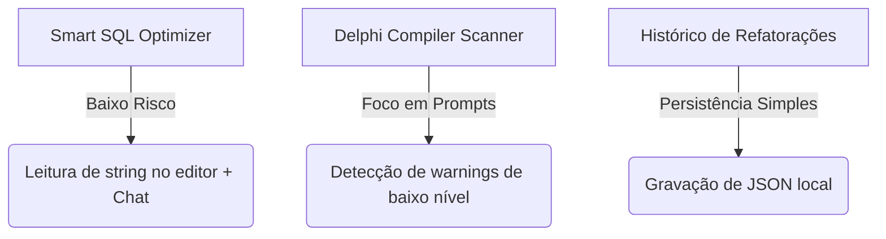

# RadIA - Matriz de Priorização e Viabilidade de Features

Este documento apresenta uma análise técnica e de negócios comparando as **13 ideias de novas features** com as **7 features que já constam no backlog/roadmap** do projeto RadIA.

A análise é estruturada sob a perspectiva de um **Arquiteto de Software Sênior**, avaliando a complexidade de implementação no ecossistema do Embarcadero Delphi (usando a Open Tools API e Windows) contra o impacto gerado no dia a dia do desenvolvedor.

---

## 📊 Matriz de Priorização (Esforço vs. Impacto)

A tabela abaixo cruza o **Esforço (Dificuldade)** com o **Impacto (Benefício)** para ajudar a guiar as próximas decisões de desenvolvimento:

| Feature | Origem | Dificuldade (Esforço) | Benefício (Impacto) | Categoria |
| :--- | :--- | :--- | :--- | :--- |
| **1. Smart SQL Optimizer no Editor** | Nova | 🟢 Baixa | 🔴 Alto | **Quick Win** (Ganho Rápido) |
| **2. Delphi Compiler & OS Warning Scanner** | Nova | 🟢 Baixa | 🔴 Alto | **Quick Win** (Ganho Rápido) |
| **3. Histórico de Refatorações Aplicadas** | Backlog | 🟢 Baixa | 🟡 Médio | **Tarefa de Apoio** |
| **4. Otimizador de Cláusula Uses (Clean Uses)** | Nova | 🟡 Média | 🔴 Alto | **Projeto Principal** |
| **5. Gerador de Mocks para Testes Unitários** | Nova | 🟡 Média | 🔴 Alto | **Projeto Principal** |
| **6. Smart Multi-Unit Trace Resolver** | Nova | 🟡 Média | 🔴 Alto | **Projeto Principal** |
| **7. MadExcept / EurekaLog Context Extractor** | Nova | 🟡 Média | 🔴 Alto | **Projeto Principal** |
| **8. Revisão Automática de Código no Save** | Backlog | 🟡 Média | 🔴 Alto | **Projeto Principal** |
| **9. Assistente de Migração (Smart Migrate)** | Backlog | 🟡 Média | 🔴 Alto | **Projeto Principal** |
| **10. Gerador de Documentação OpenAPI/Swagger** | Nova | 🟡 Média | 🔴 Alto | **Projeto Principal** |
| **11. Análise Semântica Bidirecional (DFM x PAS)** | Nova | 🟡 Média | 🟡 Médio-Alto | **Projeto Principal** |
| **12. Geração de Docs de Projeto (API.md)** | Backlog | 🟡 Média | 🟡 Médio-Alto | **Projeto Principal** |
| **13. Painel de Gerenciamento do Cache** | Backlog | 🟡 Média | 🟡 Médio | **Tarefa de Apoio** |
| **14. Conversão BDE/ADO/dbExpress ➔ DEXT com FireDAC** | Nova | 🔴 Alta | 🔴 Alto | **Aposta Estratégica** |
| **15. Decompositor de Forms (Code-Behind)** | Nova | 🔴 Alta | 🔴 Alto | **Aposta Estratégica** |
| **16. Assistente de Threads e PPL** | Nova | 🔴 Alta | 🔴 Alto | **Aposta Estratégica** |
| **17. Internacionalização Automática (i18n)** | Nova | 🔴 Alta | 🔴 Alto | **Aposta Estratégica** |
| **18. Autocompletar Inline (Ghost Text)** | Backlog | 🔴 Alta | 🔴 Alto | **Aposta Estratégica** |
| **19. Integração com Depurador da IDE (OTA)** | Backlog | 🔴 Alta | 🔴 Alto | **Aposta Estratégica** |
| **20. Suporte Nativo macOS/Linux (Lazarus)** | Backlog | 🔴 Alta | 🟡 Baixo-Médio | **Descarte/Longo Prazo** |

---

## 🟢 1. Grau de Dificuldade: Baixo (Esforço Reduzido)

Features que não demandam integrações complexas de baixo nível com o editor do Delphi, APIs do depurador ou manipulações pesadas de arquivos do sistema. São focadas em processar entradas de texto do usuário ou capturar seleções simples via Open Tools API.

### 1.1. Smart SQL Optimizer no Editor (Nova)
* **Benefício:** **Alto**. Previne erros de sintaxe de SQL ocultos em strings e melhora a performance de consultas antes do commit.
* **Complexidade:** **Baixa**. O plugin lê a linha atual ou o bloco selecionado de texto contendo comandos SQL através da Open Tools API, envia-o para a IA validar de acordo com o dialeto de banco selecionado, e retorna as sugestões de otimização no chat lateral.

### 1.2. Delphi Compiler & OS Warning Scanner (Nova)
* **Benefício:** **Alto**. Previne bugs silenciosos do ecossistema do Delphi (ex: travamentos por chamadas visuais sem sincronização de threads, conflitos de string Unicode, vazamentos de handles do Windows).
* **Complexidade:** **Baixa**. Consiste principalmente no desenvolvimento de modelos estruturados de prompt para a análise estática executada no comando `/bugs`, ensinando a IA a focar especificamente em armadilhas conhecidas de runtime e compilador da VCL.

### 1.3. Histórico de Refatorações Aplicadas (Backlog - v0.1.0)
* **Benefício:** **Médio**. Fornece rastreabilidade e auditoria interna, permitindo que o desenvolvedor veja e desfaça edições que a IA realizou diretamente pelo editor.
* **Complexidade:** **Baixa**. Consiste em gravar um log incremental contendo `Data`, `Arquivo`, `Trecho Anterior` e `Trecho Novo` em um diretório JSON local (ex: `%APPDATA%\RadIA\history\`) a cada clique no botão **[Aplicar Alteração]**.

---

## 🟡 2. Grau de Dificuldade: Médio (Esforço Moderado)

Features que envolvem manipulação estrutural de código Object Pascal (reescrita de strings complexas, uses, interfaces), ganchos (hooks) em eventos padrão da IDE, ou interfaces adicionais de configuração.

### 2.1. Otimizador de Cláusula Uses (Clean Uses) (Nova)
* **Benefício:** **Alto**. Mantém as units limpas de importações órfãs, otimizando o compilador e reduzindo a dívida técnica acumulada.
* **Complexidade:** **Média**. Requer varrer as cláusulas `uses` e fazer uma busca cruzada rápida de dependências (tipos de dados e chamadas de métodos utilizados no corpo da unit). A IA é excelente neste tipo de cruzamento de contexto sem requerer um parser AST completo implementado em Delphi.

### 2.2. Gerador de Mocks para Testes Unitários (Nova)
* **Benefício:** **Alto**. Facilita a adoção de testes unitários no Delphi, permitindo isolar componentes acoplados que dependem de bancos de dados ou conexões externas.
* **Complexidade:** **Média**. Utiliza a base já existente de geração de testes do RadIA. A IA mapeia as dependências da classe (interfaces de construtores) e gera o código mock (compatível com Delphi-Mocks ou mocks manuais com interfaces) dentro do repositório de testes.

### 2.3. Smart Multi-Unit Trace Resolver (Nova)
* **Benefício:** **Alto**. Permite a resolução de exceções reais complexas que trafegam entre múltiplas camadas do sistema (Controller, Service, Repository), lendo automaticamente os arquivos físicos correspondentes e provendo contexto global para a IA.
* **Complexidade:** **Média**. A OTA do Delphi permite rastrear e ler o código-fonte de quaisquer arquivos vinculados ao projeto ativo. O RadIA parseia as linhas do stack trace, carrega em background os trechos específicos dessas units e injeta tudo de forma estruturada no contexto da IA.

### 2.4. MadExcept / EurekaLog Context Extractor (Nova)
* **Benefício:** **Alto**. A IA ganha "visibilidade de runtime", analisando as exceções com base nos valores reais das variáveis e objetos locais coletados pelo log de erro no instante exato da falha do sistema.
* **Complexidade:** **Média**. Exige a criação de rotinas regex para extrair a lista e o estado das variáveis listadas nos logs de crash e formatá-los para a IA como metadados do prompt.

### 2.5. Revisão Automática de Código no Save (Backlog - v0.1.0)
* **Benefício:** **Alto**. Garante que boas práticas (Clean Code/SOLID) sejam analisadas continuamente sem a necessidade de acionamento manual do desenvolvedor.
* **Complexidade:** **Média**. Necessita interceptar o evento de gravação da IDE (`IOTAModuleNotifier.AfterSave`), coletar as alterações e enviar uma requisição silenciosa em background. O desafio é não bloquear o processo de gravação e exibir as mensagens de alerta de forma não-intrusiva no painel RadIA.

### 2.6. Assistente de Migração de Versão (Smart Migrate) (Backlog - v0.2.0)
* **Benefício:** **Alto**. Acelera drasticamente a modernização de projetos antigos baseados em Delphi 7/XE para Delphi moderno (10.4/11/12), lidando com tipos de strings Unicode, chamadas de rede legadas e substituição de bibliotecas obsoletas.
* **Complexidade:** **Média**. Funciona de forma similar às refatorações existentes, utilizando templates e prompts focados em padrões Delphi moderno.

### 2.7. Gerador de Documentação OpenAPI/Swagger (Nova)
* **Benefício:** **Alto**. Essencial para times que usam Delphi no backend com Horse ou RAD Server, economizando dias de digitação manual de especificações.
* **Complexidade:** **Média**. O RadIA precisa varrer as rotas registradas nas classes de controle ou nas units de inicialização da API, ler as estruturas dos DTOs referenciados e compilar o arquivo de configuração Swagger (JSON/YAML).

### 2.8. Análise Semântica Bidirecional (DFM vs PAS) (Nova)
* **Benefício:** **Médio-Alto**. Remove o lixo acumulado em formulários legados (declarações invisíveis de componentes removidos e eventos órfãos).
* **Complexidade:** **Média**. Envolve a leitura cruzada do arquivo `.dfm` (em modo texto) e a unit `.pas`, identificando componentes instanciados no DFM que não possuem referência ativa ou manipulação no código-fonte.

### 2.9. Geração de Documentação de Projeto (Backlog - v0.3.0+)
* **Benefício:** **Médio-Alto**. Gera sumários arquiteturais e mapeia as units do projeto em um arquivo de documentação centralizado (ex: `docs/API.md`).
* **Complexidade:** **Média**. A IA analisa a estrutura de pastas do projeto ativo, lê o cabeçalho das principais classes (`/// 
`) e gera um arquivo Markdown estruturado.

### 2.10. Painel de Gerenciamento do Cache (Backlog - v0.2.0)
* **Benefício:** **Médio**. Ajuda a gerenciar os custos e depurar as respostas salvas da IA localmente.
* **Complexidade:** **Média**. Exige a criação de uma tela VCL clássica em `Source/UI/` que lista os itens salvos no cache local e permite sua exclusão individual ou total.

---

## 🔴 3. Grau de Dificuldade: Alto (Esforço Elevado / Risco)

Features que alteram profundamente a estrutura de múltiplos arquivos simultaneamente (DFM + PAS), necessitam de manipulação complexa de programação concorrente (multithreading), dependem de engenharia de UI intrusiva no editor do Delphi ou de ports multiplataforma.

### 3.1. Conversão BDE/ADO/dbExpress ➔ DEXT com FireDAC (Nova)
* **Benefício:** **Alto**. Modernização completa da infraestrutura de dados de sistemas legados. Em vez de apenas substituir componentes pontuais de acesso, migra toda a estrutura relacional manual acoplada para um modelo ORM de alta produtividade (DEXT ORM) utilizando o FireDAC por baixo como mecanismo físico de transporte.
* **Complexidade:** **Alta**.
  * **No DFM:** Mapear e remover queries manuais e tabelas obsoletas (ex: `TTable`, `TQuery`, `TSQLQuery`, `TADOQuery`), além de limpar conexões legadas (`TSQLConnection`, `TDatabase`, `TADOConnection`).
  * **No PAS (Código):** A IA precisa reescrever todas as referências que manipulavam os datasets manualmente (como `FieldByName`, `Next`, `Eof`, `Post`) e substituí-las pela sintaxe orientada a objetos do DEXT ORM (ex: `TDext.Save()`, mapeamento de entidades locais, loops sobre listas tipadas de objetos).
  * **Desafio:** A IA precisa gerar novas classes de Entidades DEXT mapeadas e inseri-las no projeto ativo, garantindo que o acoplamento original visual (como `TDataSource` conectado a controles de tela) seja convertido para os recursos de LiveBindings ou preenchimento manual moderno.

### 3.2. Decompositor de Formulários Legados (Code-Behind Extractor) (Nova)
* **Benefício:** **Alto**. Resolve uma das maiores dores arquiteturais da comunidade Delphi.
* **Complexidade:** **Alta**. Requer uma modificação cirúrgica: remover métodos e referências dentro do `.pas` original, alterar a vinculação de propriedades e eventos no `.dfm`, criar uma nova unit contendo a lógica extraída e registrar os imports corretos na unit de origem sem quebrar a compilação do Delphi.

### 3.3. Assistente de Threads e PPL (Parallel Programming Library) (Nova)
* **Benefício:** **Alto**. Torna aplicações Delphi responsivas, evitando congelamentos de tela que arruínam a experiência do usuário.
* **Complexidade:** **Alta**. A IA precisa identificar todas as dependências do bloco síncrono original que interagem com componentes visuais e reescrever o código encapsulando o fluxo em `TTask.Run`. O maior desafio é garantir que a IA não introduza vazamentos de memória (Memory Leaks) e race conditions nas sincronizações de threads secundárias.

### 3.4. Internacionalização Automática (i18n Wizard) (Nova)
* **Benefício:** **Alto**. Abre mercados internacionais para produtos de software legados em Delphi.
* **Complexidade:** **Alta**. Demanda varrer exaustivamente o DFM (para traduzir Captions, Hints, e labels estáticos) e o PAS (para localizar strings literais de ShowMessages, mensagens de erro e exceções). O plugin precisa criar o arquivo externo de localização e injetar funções de tradução de runtime em centenas de locais sem introduzir bugs de sintaxe.

### 3.5. Autocompletar Inline Inteligente (Ghost Text) (Backlog - v0.3.0+)
* **Benefício:** **Alto**. Fornece a experiência premium de co-pilotagem de código em tempo real no editor do Delphi, semelhante ao VS Code.
* **Complexidade:** **Muito Alta**. A Open Tools API (OTA) do Delphi **não fornece suporte nativo** para desenhar texto fantasma (cinza) inline no editor de código. Implementar isso exige o uso de técnicas avançadas e arriscadas do Windows, como subclassing de janelas Win32, interceptação de mensagens do Windows (messages hooking) e hooks nas rotas de pintura gráfica (GDI / Direct2D) da IDE.

### 3.6. Integração com Depurador da IDE (OTA) (Backlog - v0.3.0+)
* **Benefício:** **Alto**. Análise de falhas em tempo de execução no exato instante em que ocorrem na depuração.
* **Complexidade:** **Alta**. Exige registrar e monitorar callbacks complexos e sensíveis da IDE usando `IOTADebuggerNotifier`. Qualquer falha ou lentidão nesse monitoramento pode travar a depuração da IDE do Delphi ou causar Access Violations na IDE (`bds.exe`).

### 3.7. Suporte Nativo macOS/Linux (Lazarus/FPC) (Backlog - v0.3.0+)
* **Benefício:** **Baixo-Médio**. Expandiria o uso do RadIA para desenvolvedores do ecossistema Free Pascal / Lazarus.
* **Complexidade:** **Muito Alta**. Toda a interface gráfica, integração com o editor de código e persistência do RadIA são estritamente vinculadas à VCL do Delphi (Windows), à Open Tools API (proprietária da Embarcadero) e ao motor WebView2 da Microsoft. Portar isso exigiria reescrever a camada de UI em LCL e substituir o motor web.

---

> [!TIP]
> **Recomendação de Próximos Passos:**
> O foco estratégico do RadIA deve ser a implementação de **Quick Wins** (Smart SQL Optimizer e Delphi Compiler Scanner), pois trazem valor imediato com baixíssimo risco de regressões. Paralelamente, podemos planejar o desenvolvimento incremental dos **Projetos Principais** de esforço médio (como a Otimização da Cláusula Uses, Smart Multi-Unit Trace Resolver e a Revisão Automática no Save), consolidando a robustez do assistente antes de partirmos para refatorações complexas em DFM.
