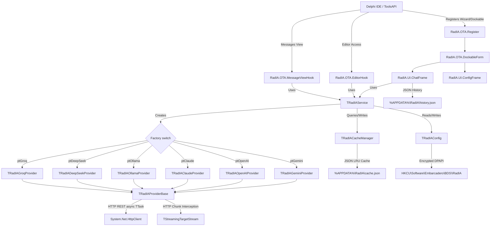

[🇧🇷 Português](implementation_plan.md) | [🇺🇸 English](implementation_plan.en.md)

# Implementation Plan: RadIA - AI Assistant for Delphi IDE

This document describes the technical architecture and components implemented in the **RadIA** plugin for Embarcadero Delphi. It reflects the current state of the actual code implementation.

---

## High-Level Architecture

The plugin is a Delphi **Design-time Package (.bpl)** integrated into the IDE through the **Open Tools API (OTA)**.

### Component Overview

---

## Architectural Layers

### 1. Core (`Source/Core/`)

| Unit | Responsibility |
|---|---|
| `RadIA.Core.Types.pas` | Shared types (`TAIMessageRole`, `TAIRequestProfile`), model constants, and provider-facing structures |
| `RadIA.Core.Interfaces.pas` | `IIAProvider`, `IAIConfig`, `IChatMessage` contracts, `TCompletionCallback` and `TStreamChunkCallback` types |
| `RadIA.Core.Config.pas` | `TRadIAConfig`: Windows Registry read/write (`HKCU\Software\Embarcadero\BDS\<version>\RadIA`), `ISettingsStorage` injection, provider parameters, local quotas, and active models |
| `RadIA.Core.ConfigDefaults.pas` | Centralizes default configuration values, reducing duplicated literals in `TRadIAConfig` |
| `RadIA.Core.CredentialProtector.pas` | Encapsulates cleanup and Windows DPAPI protection for sensitive keys |
| `RadIA.Core.Service.pas` | `TRadIAService`: central request orchestrator (`SendPrompt` and `SendPromptStream`), creates active provider, injects system prompt and `.radia` project context, applies history trimming |
| `RadIA.Core.Cache.pas` | `TRadIACacheManager`: LRU cache in JSON (`cache.json`), 500 entries limit, 24h expiration, SHA-1 hash |
| `RadIA.Core.PromptHistory.pas` | `TPromptHistoryManager`: recent query history (FIFO limit 50) persisted in JSON for ↑/↓ navigation in chat |
| `RadIA.Core.TokenUsage.pas` | `TTokenUsage` record (PromptTokens, CompletionTokens) and UI status bar helper |
| `RadIA.Core.ConversationExporter.pas` | `TConversationExporter`: formatted exporter for Markdown and self-contained HTML formats |
| `RadIA.Core.PromptTemplates.pas` | `TPromptTemplateManager`: manages native templates and user overlays in `%APPDATA%\RadIA\templates.json`, including separated slash commands for `/explain` and `/review` |
| `RadIA.Core.ProjectContext.pas` | `TProjectContextLoader`: reads `.radia` files from the active project's root folder and merges system prompts |

---

## 2. Providers (`Source/Providers/`)

All inherit from `TRadIAProviderBase` and implement `IIAProvider`.

| Unit | Endpoint | SSE Streaming |
|---|---|---|
| `RadIA.Provider.Base.pas` | — | Base class: supports `TStreamingTargetStream` to intercept real-time HTTP buffers on `THTTPClient.Post` call |
| `RadIA.Provider.Gemini.pas` | `generateContent` / `streamGenerateContent` | Yes, via incremental JSON parsing with balanced brackets control |
| `RadIA.Provider.OpenAI.pas` | `/v1/chat/completions` | Yes, via Server-Sent Events parsing (data: `choices[0].delta`) |
| `RadIA.Provider.Claude.pas` | `/v1/messages` | Yes, via SSE parsing (data: `content_block_delta` and `message_stop`) |
| `RadIA.Provider.Ollama.pas` | `/api/chat` | Yes, via newline-delimited JSON objects parsing |
| `RadIA.Provider.DeepSeek.pas` | `/chat/completions` | Yes, via SSE parsing (data: `choices[0].delta` and `[DONE]`) |
| `RadIA.Provider.Groq.pas` | `/openai/v1/chat/completions` | Yes, via SSE parsing (data: `choices[0].delta` and `[DONE]`) |

---

### 3. IDE Integration (`Source/Integration/`)

| Unit | Responsibility |
|---|---|
| `RadIA.OTA.Register.pas` | Registers the Wizard/package in the IDE, creates menu items in `Tools` and editor context menu |
| `RadIA.OTA.Helper.pas` | `ReplaceActiveEditorText`: reads selection and replaces text in active editor. `GetActiveProjectFolder` gets project folder |
| `RadIA.OTA.ContextParser.pas` | Extracts the interface section of active unit and class attributes under the cursor |
| `RadIA.OTA.EditorHook.pas` | Manages hotkeys and the **RadIA** submenu at the top of the editor context menu, using asynchronous hooks compatible with Delphi 12/13 |
| `RadIA.OTA.MessageViewHook.pas` | Monitors IDE Messages View and extracts compiler error data to trigger AI explanation |
| `RadIA.OTA.DockableForm.pas` | Implements `INTADockableForm`, wraps `TFrameAIChat`, and applies theme via `IOTAThemeServices` |

---

### 4. User Interface (`Source/UI/`)

#### `RadIA.UI.ChatFrame` — Main Chat Frame

**VCL Components:**
- `cbProvider` / `cbModel`: selects active AI provider and model.
- `btnSettings`: opens the settings dialog.
- `btnClear`: clears the active chat history.
- `btnExport`: exports chat to Markdown/HTML.
- `btnTemplates`: dynamic templates popup.
- `memPrompt + btnSend`: message input and sending.
- `EdgeBrowser`: Vcl EdgeBrowser loading local `chat.html`.

**Delphi ↔ WebView2 Integration:**
- Delphi → Web: `PostWebMessageAsJson` with `{ action, role, text, isDone }` JSON.
  - `action: 'add_message'` — adds a complete message.
  - `action: 'clear_chat'` — clears the chat.
  - `action: 'set_theme'` — changes the active theme.
  - `action: 'update_tokens'` — updates tokens and costs.
  - `action: 'show_typing'` — shows typing indicator.
  - `action: 'append_message'` — appends text chunk to the last bubble.
- Web → Delphi: `EdgeBrowserWebMessageReceived` with `{ action: 'apply_code', code }` JSON.
- Web assets (`chat.html`, `chat.js`, CSS, and JS bridge files) are copied by the installer to the IDE public folder and `%APPDATA%\RadIA\Web`; `chat.html` uses cache busting for `chat.js` to avoid stale WebView2 JavaScript.

---

## Unit Tests (DUnitX)

| Suite | Tests | What it covers |
|---|---|---|
| `TTestRadIAConfig` | 10 | Read, write, and DPAPI encryption of keys and settings like `MaxHistoryMessages` |
| `TTestRadIAProviders` | 11 | Payload parsing, HTTP handling, and RTTI decoding helpers |
| `TTestRadIACacheManager` | 2 | LRU cache and temporal expiration |
| `TTestRadIAOllama` | 2 | Ollama generation and parsing |
| `TTestRadIAService` | 10 | Automatic message trimming under limit, prioritizing system and most recent messages |
| `TTestPromptHistory` | 13 | FIFO query history and persistence |
| `TTestTokenUsage` | 2 | Token initialization validation and UI statistics formatting |
| `TTestConversationExporter` | 4 | Structured markdown/HTML layout generation |
| `TTestPromptTemplates` | 10 | Embedded templates, overlays, legacy template migration, and `/explain` vs `/review` separation |
| `TTestProjectContext` | 4 | Reading and merging the `.radia` file |
| `TTestRadIAStreaming` | 8 | Incremental validation of SSE streaming buffers and boundaries (OpenAI, Claude, Gemini, Ollama) |
| `TTestRadIAProvidersEx` | 17 | Payloads, response parsing, and streams for DeepSeek, Groq, OpenRouter, LM Studio, Azure OpenAI, Qwen, Mistral, and Bedrock |
| `TTestChatPresenter` | 14 | Chat presenter flows, global messages, slash commands, and WebView integration |
| `TTestConfigPresenter` | 8 | Settings presenter flows and validations |
| `TTestEditorHook` | 2 | Editor context-menu rehook and regression protection |
| **Total** | **143** | **143/143 passing cleanly on Delphi 12 and Delphi 13** |

---

## Design Decisions

- **ProcessStreamBuffer isolation:** Each provider extracts the tokenization and incremental stream parser algorithm in a dedicated method, facilitating unit tests via RTTI.
- **Token Approximation in Stream:** During dynamic display of SSE chunks, token count is estimated using the default multiplier (1 token ≈ 4 characters) in completion callback.
- **Locale Invariant for USD:** Cost formatting enforces the dot `.` decimal delimiter to guarantee currency in USD regardless of the user's Windows regional settings.
- **No stale WebView2 cache:** The installer synchronizes local web assets and clears the WebView2 cache while the IDE is closed; the HTML also loads `chat.js` with cache busting.
- **Explicit slash commands:** Critical commands such as `/explain` and `/review` use separate native templates to avoid resolution based on list order or legacy overlays.
