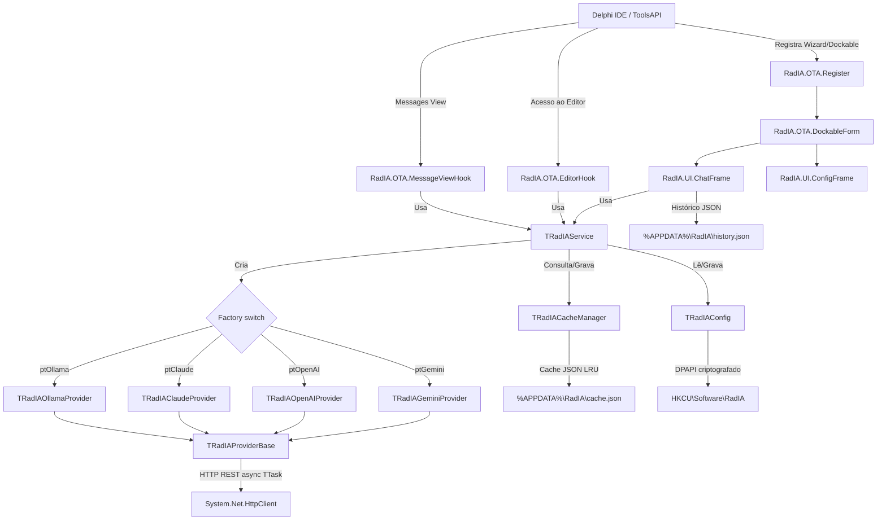

# Plano de Implementação: RadIA - Assistente de IA para Delphi IDE

Este documento descreve a arquitetura técnica e os componentes implementados no plugin **RadIA** para o Embarcadero Delphi. Reflete o estado atual da implementação real do código.

---

## Arquitetura de Alto Nível

O plugin é um **Design-time Package (.bpl)** do Delphi integrado à IDE através da **Open Tools API (OTA)**.

### Visão Geral dos Componentes



---

## Camadas Arquiteturais

### 1. Core (`Source/Core/`)

| Unit | Responsabilidade |
|---|---|
| `RadIA.Core.Types.pas` | Enum `TAIProviderType` (Gemini, OpenAI, Claude, Ollama), `TAIMessageRole`, constantes de modelos, funções de conversão string/enum |
| `RadIA.Core.Interfaces.pas` | Contratos `IIAProvider`, `IAIConfig`, `IChatMessage`, tipo `TCompletionCallback` |
| `RadIA.Core.Config.pas` | `TRadIAConfig`: leitura/escrita no Registro do Windows (`HKEY_CURRENT_USER\Software\RadIA`), criptografia de API Keys via DPAPI (`CryptProtectData`/`CryptUnprotectData`) |
| `RadIA.Core.Service.pas` | `TRadIAService`: orquestrador que cria o provedor ativo, injeta system prompt, consulta cache antes de enviar, salva no cache após resposta. `TRadIAChatMessage` concreto de `IChatMessage` |
| `RadIA.Core.Cache.pas` | `TRadIACacheManager`: cache LRU em JSON (`cache.json`), limite de 500 entradas, expiração de 24h, hash SHA-1 por `provider+model+systemprompt+prompt+history` |

#### Configurações persistidas no Registro

| Chave do Registro | Tipo | Descrição |
|---|---|---|
| `ActiveProvider` | Integer | Enum `TAIProviderType` do provedor ativo |
| `Gemini_ApiKey` | String | API Key do Gemini (Base64 criptografado com DPAPI) |
| `OpenAI_ApiKey` | String | API Key da OpenAI (Base64 criptografado com DPAPI) |
| `Claude_ApiKey` | String | API Key do Claude (Base64 criptografado com DPAPI) |
| `Ollama_ApiKey` | String | Não utilizado (Ollama não requer key) |
| `Gemini_ActiveModel` | String | Modelo ativo do Gemini (ex: `gemini-1.5-flash`) |
| `OpenAI_ActiveModel` | String | Modelo ativo da OpenAI (ex: `gpt-4o-mini`) |
| `Claude_ActiveModel` | String | Modelo ativo do Claude (ex: `claude-3-haiku-20240307`) |
| `Ollama_ActiveModel` | String | Modelo ativo do Ollama (ex: `llama3:latest`) |
| `SystemPrompt` | String | Instrução de sistema customizada (plain text) |
| `OllamaBaseUrl` | String | URL base do servidor Ollama (padrão: `http://localhost:11434`) |

---

### 2. Provedores (`Source/Providers/`)

Todos herdam de `TRadIAProviderBase` e implementam `IIAProvider`.

| Unit | Endpoint | Autenticação |
|---|---|---|
| `RadIA.Provider.Base.pas` | — | Classe base: `DoPostRequest`, `DoGetRequest` via `THTTPClient`. `FetchAvailableModelsAsync` padrão (usa `TThread.Queue`). |
| `RadIA.Provider.Gemini.pas` | `POST /v1beta/models/{model}:generateContent` | Header `x-goog-api-key` |
| `RadIA.Provider.OpenAI.pas` | `POST /v1/chat/completions` | Header `Authorization: Bearer {key}` |
| `RadIA.Provider.Claude.pas` | `POST /v1/messages` | Header `x-api-key` + `anthropic-version: 2023-06-01` |
| `RadIA.Provider.Ollama.pas` | `POST /api/chat` (stream=false) / `GET /api/tags` | Sem autenticação |

#### Ollama — Comportamentos específicos
- **Descoberta de modelos:** `GET <OllamaBaseUrl>/api/tags` → extrai campo `name` de cada objeto em `models[]`. Fallback estático: `llama3:latest`, `codellama:latest`, `mistral:latest`, `phi3:latest`.
- **Envio:** `POST <OllamaBaseUrl>/api/chat` com payload `{ model, stream: false, messages: [...history, currentPrompt] }`.
- **Resposta:** extrai `message.content` do JSON retornado.

---

### 3. Integração com a IDE (`Source/Integration/`)

| Unit | Responsabilidade |
|---|---|
| `RadIA.OTA.Register.pas` | Registra o Wizard/package na IDE, cria ações no menu `Tools` e no menu de contexto do editor |
| `RadIA.OTA.Helper.pas` | `ReplaceActiveEditorText`: lê seleção e substitui texto no buffer do editor ativo via `IOTAEditBlock` |
| `RadIA.OTA.ContextParser.pas` | Extrai a cláusula `interface` da unit ativa e os atributos da classe onde está o cursor |
| `RadIA.OTA.EditorHook.pas` | Gerencia atalhos de teclado e customizações dos menus de contexto do editor |
| `RadIA.OTA.MessageViewHook.pas` | Monitora a Messages View da IDE e extrai dados do erro compilado para acionar análise pela IA |
| `RadIA.OTA.DockableForm.pas` | Implementa `INTADockableForm`, encapsula o `TFrameAIChat` e ajusta o tema via `IOTAThemeServices` |

---

### 4. Interface do Usuário (`Source/UI/`)

#### `RadIA.UI.ChatFrame` — Frame Principal do Chat

**Componentes VCL:**
- `cbProvider`: seleciona o provedor ativo; ao mudar, salva no config e recarrega modelos.
- `cbModel`: modelos disponíveis carregados via `FetchAvailableModelsAsync`.
- `btnSettings`: abre a janela de configurações (modal 340×585).
- `btnClear`: limpa `FHistory`, envia `clear_chat` para WebView e apaga `history.json`.
- `memPrompt + btnSend`: entrada de texto, envio para IA.
- `EdgeBrowser`: renderiza o chat via `TEdgeBrowser` usando `chat.html` local.

**Comunicação Delphi ↔ WebView2:**
- **Delphi → Web:** `PostWebMessageAsJson` com JSON `{ action, role, text }`.
  - `action: 'add_message'` — exibe mensagem no chat.
  - `action: 'clear_chat'` — limpa toda a conversa na tela.
  - `action: 'set_theme'` — aplica tema `dark` ou `light`.
- **Web → Delphi:** `EdgeBrowserWebMessageReceived` com JSON `{ action: 'apply_code', code }` → chama `TRadIAOTAHelper.ReplaceActiveEditorText`.

**Histórico Persistente:**
- `LoadChatHistory`: ao inicializar o WebView, lê `%APPDATA%\RadIA\history.json`, recria `FHistory: TArray<IChatMessage>` e renderiza na WebView.
- `SaveChatHistory`: após cada par user/assistant, serializa `FHistory` para JSON e grava no arquivo.
- Mensagens `mrSystem` são excluídas do arquivo de histórico.

#### `RadIA.UI.ConfigFrame` — Tela de Configurações

Campos presentes (DFM, 320×525):
- `edtGeminiKey`: API Key do Gemini (campo senha `*`).
- `edtOpenAIKey`: API Key da OpenAI (campo senha `*`).
- `edtClaudeKey`: API Key do Anthropic Claude (campo senha `*`).
- `edtOllamaUrl`: URL base do servidor Ollama (texto livre, padrão `http://localhost:11434`).
- `memSystemPrompt`: instrução de sistema customizada (TMemo).
- `btnSave` / `btnCancel`.

#### `RadIA.UI.DiffForm` — Visualizador de Diff

Tela modal com visualização lado a lado (Original vs. Sugerido) usando `diff2html` via WebView2, com botão **[Aplicar Alteração]** que chama `TRadIAOTAHelper.ReplaceActiveEditorText`.

#### `Source/UI/Web/` — Arquivos da Interface Web

| Arquivo | Função |
|---|---|
| `chat.html` | Estrutura HTML do chat. Recebe mensagens via `window.chrome.webview.addEventListener('message', ...)`. |
| `chat.css` | Estilos modernos com suporte a temas Dark/Light. |
| `chat.js` | Lógica JS: Marked.js (Markdown), Prism.js (syntax highlighting Pascal), botão "Apply Code". |
| `diff.html` | Interface do Smart Diff com `diff2html`. |

Os arquivos web são copiados de `Source/UI/Web/` para `%APPDATA%\RadIA\Web\` no início de cada sessão da IDE via `CopyWebFiles`.

---

### 5. Cache de Respostas (`TRadIACacheManager`)

- **Algoritmo:** LRU (Least Recently Used), limite padrão de **500 entradas**.
- **Expiração:** Entradas com mais de **24 horas** são descartadas automaticamente no próximo acesso.
- **Hash:** SHA-1 sobre a concatenação de `provider || model || systemPrompt || prompt || historyJSON`.
- **Persistência:** JSON em `%APPDATA%\RadIA\cache.json`, campos `hash`, `response`, `timestamp`, `last_accessed` (formato ISO 8601).
- **Fluxo no `SendPrompt`:**
  1. Gera hash.
  2. Consulta cache → se acerto, retorna com `AFromCache = True`.
  3. Se erro, chama `SendPromptAsync` no provedor.
  4. Sucesso → salva no cache. Callback com `AFromCache = False`.

---

## Estrutura de Diretórios Real

```
PluginDelphiIA/
│
├── README.md
├── RadIA.groupproj
├── RadIA.dpk
├── RadIA.dproj
│
├── Source/
│   ├── Core/
│   │   ├── RadIA.Core.Types.pas
│   │   ├── RadIA.Core.Interfaces.pas
│   │   ├── RadIA.Core.Config.pas
│   │   ├── RadIA.Core.Cache.pas
│   │   └── RadIA.Core.Service.pas
│   │
│   ├── Providers/
│   │   ├── RadIA.Provider.Base.pas
│   │   ├── RadIA.Provider.Gemini.pas
│   │   ├── RadIA.Provider.OpenAI.pas
│   │   ├── RadIA.Provider.Claude.pas
│   │   └── RadIA.Provider.Ollama.pas
│   │
│   ├── Integration/
│   │   ├── RadIA.OTA.Register.pas
│   │   ├── RadIA.OTA.Helper.pas
│   │   ├── RadIA.OTA.ContextParser.pas
│   │   ├── RadIA.OTA.EditorHook.pas
│   │   ├── RadIA.OTA.MessageViewHook.pas
│   │   └── RadIA.OTA.DockableForm.pas
│   │
│   └── UI/
│       ├── RadIA.UI.ChatFrame.pas / .dfm
│       ├── RadIA.UI.ConfigFrame.pas / .dfm
│       ├── RadIA.UI.DiffForm.pas / .dfm
│       ├── RadIA.UI.Resources.pas
│       └── Web/
│           ├── chat.html
│           ├── chat.css
│           ├── chat.js
│           └── diff.html
│
└── Tests/
    ├── RadIATests.dpr
    └── Source/
        ├── RadIA.Tests.Config.pas
        ├── RadIA.Tests.Providers.pas
        ├── RadIA.Tests.Cache.pas
        └── RadIA.Tests.Ollama.pas
```

---

## Arquivos de Dados em Runtime

| Arquivo | Caminho | Conteúdo |
|---|---|---|
| Histórico de Chat | `%APPDATA%\RadIA\history.json` | Array JSON de `{ role, content }` (sem mensagens system) |
| Cache de Respostas | `%APPDATA%\RadIA\cache.json` | Array JSON de `{ hash, response, timestamp, last_accessed }` |
| Arquivos Web | `%APPDATA%\RadIA\Web\` | `chat.html`, `chat.css`, `chat.js`, `diff.html` |

---

## Testes Unitários (DUnitX)

| Suite | Testes | O que cobre |
|---|---|---|
| `TTestRadIAConfig` | 5 | Persistência de provider, API key (DPAPI encrypt/decrypt), model, system prompt, **OllamaBaseUrl** |
| `TTestRadIAProviders` | 8 | Parse de JSON Gemini/OpenAI/Claude, formatação de payloads, tratamento de erro HTTP |
| `TTestRadIACacheManager` | 2 | Put/Get, expiração LRU |
| `TTestRadIAOllama` | 2 | `BuildRequestBody` (RTTI), `ParseResponseBody` (RTTI) |
| **Total** | **17** | **17/17 passando** |

---

## Decisões de Design

| Decisão | Justificativa |
|---|---|
| DPAPI para API Keys | Criptografia nativa do Windows, sem dependência extra, vinculada ao usuário logado |
| Registro do Windows para config | Persiste entre versões do Delphi instaladas na mesma máquina |
| JSON para cache e histórico | Legível, sem dependência de banco de dados, trivial de debugar/editar manualmente |
| `TTask.Run` + `TThread.Queue` | Chamadas de rede em background sem bloquear a thread da IDE; callback retorna na thread principal |
| LRU com SHA-1 | SHA-1 é suficientemente único para hashing de prompts, rápido e disponível nativamente no Delphi |
| `stream: false` no Ollama | Simplicidade: aguarda resposta completa, sem complexidade de parsing de stream SSE |
