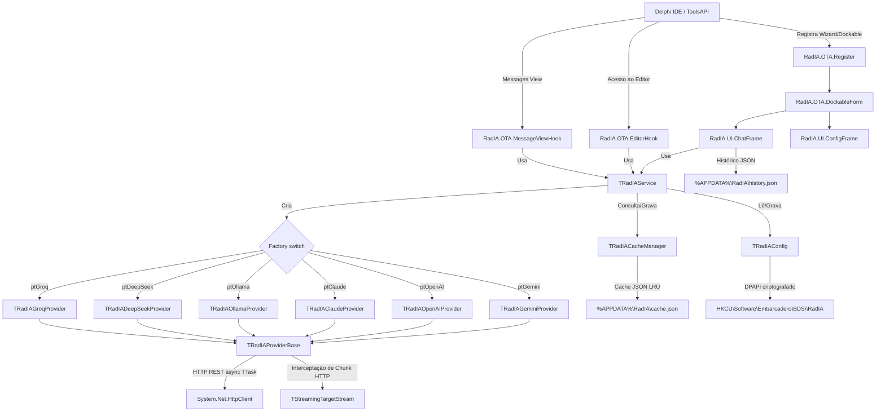

[🇧🇷 Português](implementation_plan.md) | [🇺🇸 English](implementation_plan.en.md)

# Plano de Implementação: RadIA - Assistente de IA para Delphi IDE

Este documento descreve a arquitetura técnica e os componentes implementados no plugin **RadIA** para o Embarcadero Delphi. Reflete o estado atual da implementação real do código.

---

## Arquitetura de Alto Nível

O plugin é um **Design-time Package (.bpl)** do Delphi integrado à IDE através da **Open Tools API (OTA)**.

### Visão Geral dos Componentes

---

## Camadas Arquiteturais

### 1. Core (`Source/Core/`)

| Unit | Responsabilidade |
|---|---|
| `RadIA.Core.Types.pas` | Tipos compartilhados (`TAIMessageRole`, `TAIRequestProfile`), constantes de modelos e estruturas usadas pelos providers |
| `RadIA.Core.Interfaces.pas` | Contratos `IIAProvider`, `IAIConfig`, `IChatMessage`, tipo `TCompletionCallback` e `TStreamChunkCallback` |
| `RadIA.Core.Config.pas` | `TRadIAConfig`: leitura/escrita no Registro do Windows (`HKCU\Software\Embarcadero\BDS\<versao>\RadIA`), injeção de `ISettingsStorage`, parâmetros por provedor, cotas locais e modelos ativos |
| `RadIA.Core.ConfigDefaults.pas` | Centraliza valores padrão de configuração, reduzindo literais duplicadas em `TRadIAConfig` |
| `RadIA.Core.CredentialProtector.pas` | Encapsula limpeza e proteção de chaves sensíveis via Windows DPAPI |
| `RadIA.Core.Service.pas` | `TRadIAService`: orquestrador central de requisições (`SendPrompt` e `SendPromptStream`), cria o provedor ativo, injeta system prompt e contexto de projeto `.radia`, aplica trimming do histórico |
| `RadIA.Core.Cache.pas` | `TRadIACacheManager`: cache LRU em JSON (`cache.json`), limite de 500 entradas, expiração de 24h, hash SHA-1 |
| `RadIA.Core.PromptHistory.pas` | `TPromptHistoryManager`: histórico de consultas recentes (FIFO limite 50) persistido em JSON para navegação ↑/↓ no chat |
| `RadIA.Core.TokenUsage.pas` | Record `TTokenUsage` (PromptTokens, CompletionTokens) e método helper de formatação de estatísticas |
| `RadIA.Core.ConversationExporter.pas` | `TConversationExporter`: gerador de arquivos formatados nos formatos Markdown e HTML autossuficiente |
| `RadIA.Core.PromptTemplates.pas` | `TPromptTemplateManager`: gerencia templates nativos e overlays do usuário em `%APPDATA%\RadIA\templates.json`, incluindo slash commands separados para `/explain` e `/review` |
| `RadIA.Core.ProjectContext.pas` | `TProjectContextLoader`: lê o arquivo `.radia` da pasta do projeto e funde system prompts |

---

## 2. Provedores (`Source/Providers/`)

Todos herdam de `TRadIAProviderBase` e implementam `IIAProvider`.

| Unit | Endpoint | Streaming SSE |
|---|---|---|
| `RadIA.Provider.Base.pas` | — | Classe base: suporta `TStreamingTargetStream` para interceptar a gravação de buffers em tempo real na chamada `THTTPClient.Post` |
| `RadIA.Provider.Gemini.pas` | `generateContent` / `streamGenerateContent` | Sim, via parsing incremental de JSON com controle de chaves balanceadas |
| `RadIA.Provider.OpenAI.pas` | `/v1/chat/completions` | Sim, via parsing de Server-Sent Events (data: `choices[0].delta`) |
| `RadIA.Provider.Claude.pas` | `/v1/messages` | Sim, via parsing de SSE (data: `content_block_delta` e `message_stop`) |
| `RadIA.Provider.Ollama.pas` | `/api/chat` | Sim, via parsing de objetos JSON delimitados por quebra de linha |
| `RadIA.Provider.DeepSeek.pas` | `/chat/completions` | Sim, via parsing de SSE (data: `choices[0].delta` e `[DONE]`) |
| `RadIA.Provider.Groq.pas` | `/openai/v1/chat/completions` | Sim, via parsing de SSE (data: `choices[0].delta` e `[DONE]`) |

---

### 3. Integração com a IDE (`Source/Integration/`)

| Unit | Responsabilidade |
|---|---|
| `RadIA.OTA.Register.pas` | Registra o Wizard/package na IDE, cria ações no menu `Tools` e no menu de contexto do editor |
| `RadIA.OTA.Helper.pas` | `ReplaceActiveEditorText`: lê seleção e substitui texto no editor ativo. `GetActiveProjectFolder` obtém a pasta do projeto |
| `RadIA.OTA.ContextParser.pas` | Extrai a cláusula `interface` da unit ativa e os atributos da classe onde está o cursor |
| `RadIA.OTA.EditorHook.pas` | Gerencia atalhos e o submenu **RadIA** no topo do menu contextual do editor, com hook assíncrono compatível com Delphi 12/13 |
| `RadIA.OTA.MessageViewHook.pas` | Monitora a Messages View da IDE e extrai dados do erro compilado para acionar análise pela IA |
| `RadIA.OTA.DockableForm.pas` | Implementa `INTADockableForm`, encapsula o `TFrameAIChat` e ajusta o tema via `IOTAThemeServices` |

---

### 4. Interface do Usuário (`Source/UI/`)

#### `RadIA.UI.ChatFrame` — Frame Principal do Chat

**Componentes VCL:**
- `cbProvider` / `cbModel`: seleciona provedor e modelo de IA ativos.
- `btnSettings`: abre janela de configurações.
- `btnClear`: limpa histórico ativo.
- `btnExport`: exporta chat para Markdown/HTML.
- `btnTemplates`: popup de templates dinâmicos.
- `memPrompt + btnSend`: entrada e envio de mensagens.
- `EdgeBrowser`: Vcl EdgeBrowser carregando arquivo `chat.html` local.

**Integração Delphi ↔ WebView2:**
- Delphi → Web: `PostWebMessageAsJson` com JSON `{ action, role, text, isDone }`.
  - `action: 'add_message'` — adiciona mensagem completa.
  - `action: 'clear_chat'` — limpa chat.
  - `action: 'set_theme'` — altera tema.
  - `action: 'update_tokens'` — atualiza contador de tokens e custo.
  - `action: 'show_typing'` — exibe indicador de digitação.
  - `action: 'append_message'` — concatena chunk de texto ao último balão.
- Web → Delphi: `EdgeBrowserWebMessageReceived` com JSON `{ action: 'apply_code', code }`.
- Recursos Web (`chat.html`, `chat.js`, CSS e bridge JS) são copiados pela instalação para a pasta pública da IDE e para `%APPDATA%\RadIA\Web`; `chat.html` usa cache busting em `chat.js` para evitar JavaScript antigo no WebView2.

---

## Testes Unitários (DUnitX)

| Suite | Testes | O que cobre |
|---|---|---|
| `TTestRadIAConfig` | 10 | Leitura, escrita e criptografia DPAPI das chaves e parâmetros como `MaxHistoryMessages` |
| `TTestRadIAProviders` | 11 | Parsers de payloads, tratamentos HTTP e RTTI helpers de decodificação |
| `TTestRadIACacheManager` | 2 | Cache LRU e expiração temporal |
| `TTestRadIAOllama` | 2 | Geração e parsing do Ollama |
| `TTestRadIAService` | 10 | Trimming automático de mensagens sob o limite, priorizando mensagens de sistema e as mais recentes |
| `TTestPromptHistory` | 13 | FIFO de histórico de comandos e persistência |
| `TTestTokenUsage` | 2 | Validação de inicialização de tokens e formatação de estatísticas para a UI |
| `TTestConversationExporter` | 4 | Geração e layout estruturado de markdown/HTML |
| `TTestPromptTemplates` | 10 | Templates embutidos, overlays, migração de templates legados e separação `/explain` vs `/review` |
| `TTestProjectContext` | 4 | Leitura e mescla do arquivo `.radia` |
| `TTestRadIAStreaming` | 8 | Validação incremental dos buffers de streaming SSE e delimitações (OpenAI, Claude, Gemini, Ollama) |
| `TTestRadIAProvidersEx` | 17 | Payloads, response parsing e streams dos provedores DeepSeek, Groq, OpenRouter, LM Studio, Azure OpenAI, Qwen, Mistral e Bedrock |
| `TTestChatPresenter` | 14 | Fluxos do presenter do chat, mensagens globais, slash commands e integração com WebView |
| `TTestConfigPresenter` | 8 | Fluxos e validações do presenter de configurações |
| `TTestEditorHook` | 2 | Rehook e proteção contra regressões do menu contextual do editor |
| **Total** | **143** | **143/143 passando de forma limpa no Delphi 12 e Delphi 13** |

---

## Decisões de Design

- **ProcessStreamBuffer isolado:** Cada provedor extrai o algoritmo de tokenização e parser de stream incremental em um método dedicado, facilitando testes unitários via RTTI.
- **Aproximação de Tokens no Stream:** Na exibição dinâmica de chunks SSE, a contagem de tokens é estimada usando o multiplicador padrão (1 token ≈ 4 caracteres) no callback de conclusão.
- **Locale Invariant para USD:** Formatações de custo estimam o delimitador decimal para ponto `.` para assegurar a moeda em USD independentemente da configuração regional do SO Windows do usuário.
- **WebView2 sem cache obsoleto:** O instalador sincroniza recursos web locais e limpa o cache WebView2 quando a IDE está fechada; o HTML também carrega `chat.js` com cache busting.
- **Slash commands explícitos:** Comandos críticos como `/explain` e `/review` têm templates nativos separados para evitar resolução dependente de ordem ou overlays legados.
