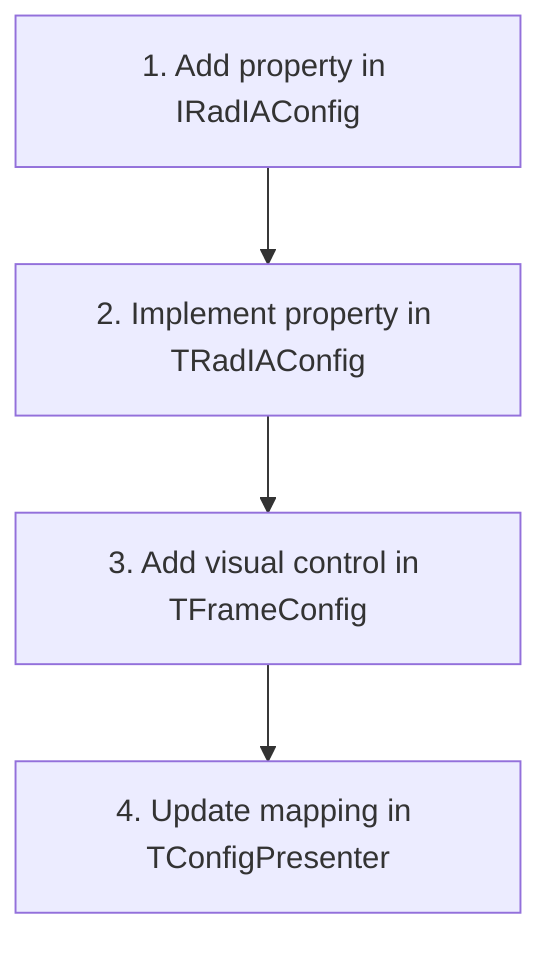

# Developer Source Code Guide - Rad IA

This document serves as a practical map of the **Rad IA** codebase. It aims to guide new programmers in navigating and understanding the repository, detailing the responsibility of each unit, and teaching how to perform common modifications safely and consistently.

For a conceptual understanding of the layered architecture, design patterns, and concurrent network flows, read the [Software Architecture Guide](file:///d:/Projetos/PluginDelphiIA/docs/architecture_guide.en.md) first.

---

## 1. Directory Structure and Code Flow

The plugin source code is concentrated in the `Source/` directory and subdivided according to architectural responsibility:

```
Source/
├── Core/           # Central business logic, models, configuration, and utilities
├── Providers/      # Adapters and clients for AI providers (Gemini, OpenAI, etc.)
├── Integration/    # Delphi IDE integration via Open Tools API (OTA)
└── UI/             # VCL-based user interfaces and Web components
    └── Web/        # HTML5/JS/CSS logic running inside WebView2 (EdgeBrowser)
```

---

## 2. Technical Unit Dictionary

### 2.1 Core Layer (`Source/Core/`)
Contains the central business rules of Rad IA. It is agnostic to the IDE and physical visual interface components.

| Unit | Technical Purpose |
| :--- | :--- |
| [RadIA.Core.Interfaces.pas](file:///d:/Projetos/PluginDelphiIA/Source/Core/RadIA.Core.Interfaces.pas) | Fundamental contracts (Interfaces) that decouple all layers of the plugin. |
| [RadIA.Core.Config.pas](file:///d:/Projetos/PluginDelphiIA/Source/Core/RadIA.Core.Config.pas) | Concrete implementation of global configuration (`TRadIAConfig`), managing endpoints, tokens, and secure keys. |
| [RadIA.Core.SettingsStorage.pas](file:///d:/Projetos/PluginDelphiIA/Source/Core/RadIA.Core.SettingsStorage.pas) | Persistent storage mechanisms. Reads/writes to the Windows Registry (`TRegistrySettingsStorage`) in production, and in-memory during tests. |
| [RadIA.Core.Container.pas](file:///d:/Projetos/PluginDelphiIA/Source/Core/RadIA.Core.Container.pas) | Static and thread-safe IoC container for dependency injection and class lifecycle decoupling. |
| [RadIA.Core.Service.pas](file:///d:/Projetos/PluginDelphiIA/Source/Core/RadIA.Core.Service.pas) | Main orchestrator (`TRadIAService`). Manages chat sessions, provider activation, and caching. |
| [RadIA.Core.Sessions.pas](file:///d:/Projetos/PluginDelphiIA/Source/Core/RadIA.Core.Sessions.pas) | Business logic for managing historical chat sessions and automatic local persistence in JSON files. |
| [RadIA.Core.PromptTemplates.pas](file:///d:/Projetos/PluginDelphiIA/Source/Core/RadIA.Core.PromptTemplates.pas) | Manages the reusable prompt catalog, slash commands, and dynamic tag replacement. |
| [RadIA.Core.Localizer.pas](file:///d:/Projetos/PluginDelphiIA/Source/Core/RadIA.Core.Localizer.pas) | Internationalization (i18n) component for dynamic localization of user interface strings. |
| [RadIA.Core.CredentialProtector.pas](file:///d:/Projetos/PluginDelphiIA/Source/Core/RadIA.Core.CredentialProtector.pas) | Encrypts and decrypts local API keys using the Windows Data Protection API (DPAPI). |
| [RadIA.Core.HttpClient.pas](file:///d:/Projetos/PluginDelphiIA/Source/Core/RadIA.Core.HttpClient.pas) | HTTP client based on the native `THTTPClient`, specialized in asynchronous consumption and SSE chunk streaming. |
| [RadIA.Core.ProjectContext.pas](file:///d:/Projetos/PluginDelphiIA/Source/Core/RadIA.Core.ProjectContext.pas) | Extracts information from the active unit in the editor or files within the current Delphi project structure. |
| [RadIA.Core.ProjectGenerator.pas](file:///d:/Projetos/PluginDelphiIA/Source/Core/RadIA.Core.ProjectGenerator.pas) | Logic for generating scaffolds and structural templates for new Delphi projects from prompts. |
| [RadIA.Core.DTO.Generator.pas](file:///d:/Projetos/PluginDelphiIA/Source/Core/RadIA.Core.DTO.Generator.pas) | Reverse engineering mechanism for converting SQL DDLs and JSON into Delphi class structures. |

### 2.2 Providers Layer (`Source/Providers/`)
Encapsulates provider-specific HTTP communication with Artificial Intelligence APIs.

| Unit | Technical Purpose |
| :--- | :--- |
| [RadIA.Provider.Base.pas](file:///d:/Projetos/PluginDelphiIA/Source/Providers/RadIA.Provider.Base.pas) | Abstract base class (`TRadIAProviderBase`) that standardizes lifecycle and asynchronous requests. |
| [RadIA.Provider.Gemini.pas](file:///d:/Projetos/PluginDelphiIA/Source/Providers/RadIA.Provider.Gemini.pas) | Native integration with the Google Gemini API (including stream parsing and chat history). |
| [RadIA.Provider.GithubCopilot.pas](file:///d:/Projetos/PluginDelphiIA/Source/Providers/RadIA.Provider.GithubCopilot.pas) | Adapter for secure connection, device login (OAuth), and consumption of GitHub Copilot APIs. |
| [RadIA.Provider.Ollama.pas](file:///d:/Projetos/PluginDelphiIA/Source/Providers/RadIA.Provider.Ollama.pas) | Client for consuming LLM models running locally via Ollama. |
| [RadIA.Provider.Claude.pas](file:///d:/Projetos/PluginDelphiIA/Source/Providers/RadIA.Provider.Claude.pas) | Specific connector for the Anthropic Claude API. |
| [RadIA.Provider.LMStudio.pas](file:///d:/Projetos/PluginDelphiIA/Source/Providers/RadIA.Provider.LMStudio.pas) | Specific connector for the local LM Studio API. |
| [RadIA.Provider.DeepSeek.pas](file:///d:/Projetos/PluginDelphiIA/Source/Providers/RadIA.Provider.DeepSeek.pas) | Adapter for consuming DeepSeek Chat and Coder models. |
| [RadIA.Provider.AzureOpenAI.pas](file:///d:/Projetos/PluginDelphiIA/Source/Providers/RadIA.Provider.AzureOpenAI.pas) | Enterprise integration with Azure OpenAI Service endpoints. |

### 2.3 Integration Layer (`Source/Integration/`)
Uses Delphi's extension APIs (**Open Tools API - OTA**) to dock visual panels and monitor the code editor.

| Unit | Technical Purpose |
| :--- | :--- |
| [RadIA.OTA.Register.pas](file:///d:/Projetos/PluginDelphiIA/Source/Integration/RadIA.OTA.Register.pas) | Plugin entry point. Registers the main Wizard in the IDE (`TRadIAWizard`) and initializes the IoC container. |
| [RadIA.OTA.EditorHook.pas](file:///d:/Projetos/PluginDelphiIA/Source/Integration/RadIA.OTA.EditorHook.pas) | Action interceptor hook. Manages right-click context menus in the Delphi IDE code editor. |
| [RadIA.OTA.ContextParser.pas](file:///d:/Projetos/PluginDelphiIA/Source/Integration/RadIA.OTA.ContextParser.pas) | Extracts and normalizes source code from the text editor to send as context in AI prompts. |
| [RadIA.OTA.DockableForm.pas](file:///d:/Projetos/PluginDelphiIA/Source/Integration/RadIA.OTA.DockableForm.pas) | IDE-compatible base form that allows Rad IA views to dock inside lateral tabs. |
| [RadIA.OTA.Helper.pas](file:///d:/Projetos/PluginDelphiIA/Source/Integration/RadIA.OTA.Helper.pas) | Encapsulates complex Open Tools API utility functions, such as inserting text and cursor positioning. |
| [RadIA.OTA.MessageViewHook.pas](file:///d:/Projetos/PluginDelphiIA/Source/Integration/RadIA.OTA.MessageViewHook.pas) | Intercepts and manages error and warning items in the IDE's "Messages" tab to enable the Smart Build Debugger. |

### 2.4 User Interface Layer (`Source/UI/`)
VCL forms and frames developed under the MVP (Model-View-Presenter) pattern.

| Unit | Technical Purpose |
| :--- | :--- |
| [RadIA.UI.ChatFrame.pas](file:///d:/Projetos/PluginDelphiIA/Source/UI/RadIA.UI.ChatFrame.pas) | Physical View of the chat panel. Contains the WebView2 component and prompt input fields. |
| [RadIA.UI.ChatPresenter.pas](file:///d:/Projetos/PluginDelphiIA/Source/UI/RadIA.UI.ChatPresenter.pas) | Chat Presenter. Coordinates sending, canceling, stream rendering, and message history. |
| [RadIA.UI.ConfigFrame.pas](file:///d:/Projetos/PluginDelphiIA/Source/UI/RadIA.UI.ConfigFrame.pas) | Physical View for configuration settings (API keys, endpoints, themes, limits). |
| [RadIA.UI.ConfigPresenter.pas](file:///d:/Projetos/PluginDelphiIA/Source/UI/RadIA.UI.ConfigPresenter.pas) | Configuration Presenter. Loads and saves settings synchronously. |
| [RadIA.UI.DiffForm.pas](file:///d:/Projetos/PluginDelphiIA/Source/UI/RadIA.UI.DiffForm.pas) | Side-by-side comparison screen (Smart Diff) with buttons to accept or reject the suggested refactoring. |
| [RadIA.UI.WebLoginForm.pas](file:///d:/Projetos/PluginDelphiIA/Source/UI/RadIA.UI.WebLoginForm.pas) | Specific screen for authenticated Web Login workflows in internal browsers for ChatGPT Plus and Gemini Advanced. |

---

## 3. Practical Maintenance Workflows

### 3.1 Adding a New Configuration Setting
If you need to save and expose a new configuration setting to the user (e.g., "Model Temperature"):



1.  **Configuration Interface**: In [RadIA.Core.Interfaces.pas](file:///d:/Projetos/PluginDelphiIA/Source/Core/RadIA.Core.Interfaces.pas), declare read and write methods in the `IRadIAConfig` interface:
    ```pascal
    function GetModelTemperature: Double;
    procedure SetModelTemperature(const AValue: Double);
    property ModelTemperature: Double read GetModelTemperature write SetModelTemperature;
    ```
2.  **Persistence Implementation**: In [RadIA.Core.Config.pas](file:///d:/Projetos/PluginDelphiIA/Source/Core/RadIA.Core.Config.pas), implement the methods. Use the `FStorage` instance to write the information to the Registry:
    ```pascal
    function TRadIAConfig.GetModelTemperature: Double;
    begin
      Result := FStorage.ReadDouble('ModelTemperature', 0.7); // 0.7 is the default value
    end;

    procedure TRadIAConfig.SetModelTemperature(const AValue: Double);
    begin
      FStorage.WriteDouble('ModelTemperature', AValue);
    end;
    ```
3.  **Add to the Graphical Interface**:
    *   Open the configuration frame [RadIA.UI.ConfigFrame.dfm](file:///d:/Projetos/PluginDelphiIA/Source/UI/RadIA.UI.ConfigFrame.dfm) in the Delphi IDE.
    *   Insert a suitable visual control (e.g., `TEdit` or `TComboBox`) and give it a standard name (e.g., `edtModelTemperature`).
    *   In the corresponding `.pas` file, declare the corresponding property in the `IRadIAConfigView` interface to expose the value to the Presenter.
4.  **Synchronize in the Presenter**: In [RadIA.UI.ConfigPresenter.pas](file:///d:/Projetos/PluginDelphiIA/Source/UI/RadIA.UI.ConfigPresenter.pas), modify the synchronization methods:
    *   In the `LoadSettings` method, load from the Model to the View:
        `FView.ModelTemperature := FConfig.ModelTemperature;`
    *   In the `SaveSettings` method, save from the View to the Model:
        `FConfig.ModelTemperature := FView.ModelTemperature;`

### 3.2 Modifying the Chat Web Interface (WebView2)
The chat interface is drawn locally using packaged web files. All HTML/JS chat logic is located in the `Source/UI/Web/` subdirectory.

*   **Main HTML**: [chat.html](file:///d:/Projetos/PluginDelphiIA/Source/UI/Web/chat.html) (Contains the visual structure and chat container).
*   **Stylesheets**: [chat.css](file:///d:/Projetos/PluginDelphiIA/Source/UI/Web/chat.css) (Controls the base chat layout) and [chat-theme.css](file:///d:/Projetos/PluginDelphiIA/Source/UI/Web/chat-theme.css) (Controls color variables for Light/Dark themes adapted from the IDE).
*   **JS Logic**: [chat.js](file:///d:/Projetos/PluginDelphiIA/Source/UI/Web/chat.js) (Handles message rendering, markdown parsing, and chat UI events) and [bridge.js](file:///d:/Projetos/PluginDelphiIA/Source/UI/Web/bridge.js) (Implements the communication bridge data channel between the BPL and WebView2).

> [!IMPORTANT]
> Any modification to JS files or web layout in `Source/UI/Web` requires running the linter to ensure there are no syntax bugs. In the project root, run:
> ```bash
> npx eslint
> ```
> The automated installer (`build.ps1`) takes care of synchronizing these files to `%APPDATA%\RadIA\Web` in local deployments so that the IDE can locate them.

---

## 4. Object Pascal Technical Rules for Source Modifications

When working in this codebase, you must strictly adhere to the following Delphi compiler constraints:

### 4.1 Avoiding the 255-Character String Literal Limit (Error E2056)
The Delphi compiler (especially in 32-bit versions used in the IDE) fails to compile continuous blocks of strings with more than 255 characters inside single quotes.
*   **Incorrect**:
    ```pascal
    LPrompt := 'This is an excessively long prompt instruction that will easily exceed the limit allowed by the Delphi compiler if not properly broken down with explicit concatenations at compile time...';
    ```
*   **Correct**:
    ```pascal
    LPrompt := 'This is an excessively long prompt instruction that ' +
               'will easily exceed the limit allowed by the Delphi compiler ' +
               'if properly broken down with concatenations.';
    ```

### 4.2 Manual Memory Management and try..finally
Delphi does not have a Garbage Collector for class instances. Whenever you create a local instance of an object, ensure its safe destruction using protection blocks:
```pascal
LList := TStringList.Create;
try
  // Perform processing on the list
finally
  LList.Free; // Frees the allocated memory even if a prior exception occurs
end;
```
*   *Note*: Always prefer the `.Free` method. Use `FreeAndNil(LVar)` only if the local variable might be reused or queried as `Assigned(LVar)` after deallocation.

### 4.3 Thread-Safety in IDE Screens
Streaming HTTP operations run in secondary background threads (`TTask`). Since VCL and the WebView2 engine are not thread-safe, **never** update visual elements directly from within the background thread.
*   **Incorrect**:
    ```pascal
    TTask.Run(procedure
    begin
      FWebBrowser.Navigate(LUrl); // Thread error in VCL!
    end);
    ```
*   **Correct**:
    ```pascal
    TTask.Run(procedure
    begin
      // Execute background HTTP call...
      TThread.Queue(nil,
        procedure
        begin
          FView.AppendMessage('user', LResponseText); // Safely runs on the main UI thread
        end);
    end);
    ```

### 4.4 WebView2 Lifecycle during IDE Shutdown
When closing the Delphi IDE, the WebView2 engine (`TEdgeBrowser`) can cause severe COM deadlocks if destroyed synchronously by the VCL.
*   When dynamically creating `TEdgeBrowser` instances, always pass `nil` as the Owner:
    `FEdgeBrowser := TEdgeBrowser.Create(nil);`
*   In the `Destroy` destructor of any form containing WebView2, check the state of the global `GIsShuttingDown` flag (located in `RadIA.Core.Types.pas`):
    ```pascal
    if not GIsShuttingDown then
    begin
      if Assigned(FEdgeBrowser) then
        FreeAndNil(FEdgeBrowser);
    end
    else
    begin
      if Assigned(FEdgeBrowser) then
        FEdgeBrowser.Parent := nil; // Detach visually without forcing synchronous COM release
    end;
    ```
