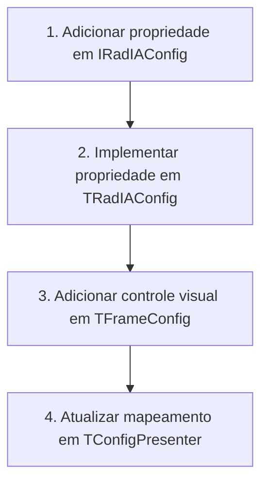

# Guia dos Arquivos Fontes para o Desenvolvedor - Rad IA

Este documento serve como um mapa prático do código-fonte do **Rad IA**. Ele visa guiar novos programadores na navegação e entendimento do repositório, detalhando a responsabilidade de cada unidade (unit) e ensinando como realizar modificações comuns de forma segura e padronizada.

Para entender a arquitetura conceitual em camadas, padrões de projeto aplicados e fluxo concorrente de rede, leia primeiro o [Guia de Arquitetura de Software](file:///d:/Projetos/PluginDelphiIA/docs/architecture_guide.md).

---

## 1. Estrutura de Diretórios e Fluxo de Código

O código-fonte do plugin está concentrado no diretório `Source/` e subdividido de acordo com a responsabilidade arquitetural:

```
Source/
├── Core/           # Regras de negócio centrais, modelos, configurações e utilitários
├── Providers/      # Adaptadores e clientes para provedores de IA (Gemini, OpenAI, etc.)
├── Integration/    # Integração com a IDE Delphi via Open Tools API (OTA)
└── UI/             # Interfaces com o usuário baseadas em VCL e componentes Web
    └── Web/        # Lógica HTML5/JS/CSS que roda na WebView2 (EdgeBrowser)
```

---

## 2. Dicionário Técnico de Unidades (Units)

### 2.1 Camada Core (`Source/Core/`)
Contém as regras centrais de negócio do Rad IA. É agnóstica à IDE e a componentes de interface visual física.

| Unidade | Propósito Técnico |
| :--- | :--- |
| [RadIA.Core.Interfaces.pas](file:///d:/Projetos/PluginDelphiIA/Source/Core/RadIA.Core.Interfaces.pas) | Contratos fundamentais (Interfaces) que desacoplam todas as camadas do plugin. |
| [RadIA.Core.Config.pas](file:///d:/Projetos/PluginDelphiIA/Source/Core/RadIA.Core.Config.pas) | Implementação concreta da configuração global (`TRadIAConfig`), gerenciamento de endpoints, tokens e chaves seguras. |
| [RadIA.Core.SettingsStorage.pas](file:///d:/Projetos/PluginDelphiIA/Source/Core/RadIA.Core.SettingsStorage.pas) | Mecanismos de armazenamento persistente. Lê/grava no Registro do Windows (`TRegistrySettingsStorage`) em produção, e em memória nos testes. |
| [RadIA.Core.Container.pas](file:///d:/Projetos/PluginDelphiIA/Source/Core/RadIA.Core.Container.pas) | Container IoC estático e thread-safe para injeção de dependência e desacoplamento do ciclo de vida das classes. |
| [RadIA.Core.Service.pas](file:///d:/Projetos/PluginDelphiIA/Source/Core/RadIA.Core.Service.pas) | Orquestrador principal (`TRadIAService`). Gerencia sessões de chat, ativação de provedores e caching. |
| [RadIA.Core.Sessions.pas](file:///d:/Projetos/PluginDelphiIA/Source/Core/RadIA.Core.Sessions.pas) | Lógica de gerenciamento de sessões de chat histórico e persistência automática em arquivos JSON locais. |
| [RadIA.Core.PromptTemplates.pas](file:///d:/Projetos/PluginDelphiIA/Source/Core/RadIA.Core.PromptTemplates.pas) | Gerencia o catálogo de prompts reutilizáveis, slash commands e suas substituições dinâmicas de tags. |
| [RadIA.Core.Localizer.pas](file:///d:/Projetos/PluginDelphiIA/Source/Core/RadIA.Core.Localizer.pas) | Componente de internacionalização (i18n) para localização dinâmica de strings da interface do usuário. |
| [RadIA.Core.CredentialProtector.pas](file:///d:/Projetos/PluginDelphiIA/Source/Core/RadIA.Core.CredentialProtector.pas) | Criptografa e descriptografa chaves de API locais usando a API de Proteção de Dados do Windows (DPAPI). |
| [RadIA.Core.HttpClient.pas](file:///d:/Projetos/PluginDelphiIA/Source/Core/RadIA.Core.HttpClient.pas) | Cliente HTTP baseado no `THTTPClient` nativo, especializado no consumo assíncrono e streaming de chunks SSE. |
| [RadIA.Core.ProjectContext.pas](file:///d:/Projetos/PluginDelphiIA/Source/Core/RadIA.Core.ProjectContext.pas) | Extrai informações da unit ativa no editor ou de arquivos da estrutura do projeto Delphi atual. |
| [RadIA.Core.ProjectGenerator.pas](file:///d:/Projetos/PluginDelphiIA/Source/Core/RadIA.Core.ProjectGenerator.pas) | Lógica para geração de scaffolds e templates estruturais de novos projetos Delphi a partir de prompt. |
| [RadIA.Core.DTO.Generator.pas](file:///d:/Projetos/PluginDelphiIA/Source/Core/RadIA.Core.DTO.Generator.pas) | Mecanismo de engenharia reversa para conversão de DDLs SQL e JSON em estruturas de classes Delphi. |

### 2.2 Camada de Provedores (`Source/Providers/`)
Encapsula a comunicação HTTP específica com cada provedor de Inteligência Artificial.

| Unidade | Propósito Técnico |
| :--- | :--- |
| [RadIA.Provider.Base.pas](file:///d:/Projetos/PluginDelphiIA/Source/Providers/RadIA.Provider.Base.pas) | Classe ancestral abstrata (`TRadIAProviderBase`) que padroniza o ciclo de vida e requisições assíncronas. |
| [RadIA.Provider.Gemini.pas](file:///d:/Projetos/PluginDelphiIA/Source/Providers/RadIA.Provider.Gemini.pas) | Integração nativa com a API do Google Gemini (incluindo parsing de stream e chat history). |
| [RadIA.Provider.GithubCopilot.pas](file:///d:/Projetos/PluginDelphiIA/Source/Providers/RadIA.Provider.GithubCopilot.pas) | Adaptador para conexão segura, login por dispositivo (OAuth) e consumo das APIs do GitHub Copilot. |
| [RadIA.Provider.Ollama.pas](file:///d:/Projetos/PluginDelphiIA/Source/Providers/RadIA.Provider.Ollama.pas) | Cliente para consumo de modelos LLM rodando localmente pelo Ollama. |
| [RadIA.Provider.Claude.pas](file:///d:/Projetos/PluginDelphiIA/Source/Providers/RadIA.Provider.Claude.pas) | Conector específico para a API Anthropic Claude. |
| [RadIA.Provider.LMStudio.pas](file:///d:/Projetos/PluginDelphiIA/Source/Providers/RadIA.Provider.LMStudio.pas) | Conector específico para a API local do LM Studio. |
| [RadIA.Provider.DeepSeek.pas](file:///d:/Projetos/PluginDelphiIA/Source/Providers/RadIA.Provider.DeepSeek.pas) | Adaptador para consumo dos modelos DeepSeek Chat e Coder. |
| [RadIA.Provider.AzureOpenAI.pas](file:///d:/Projetos/PluginDelphiIA/Source/Providers/RadIA.Provider.AzureOpenAI.pas) | Integração corporativa com endpoints do Azure OpenAI Service. |

### 2.3 Camada de Integração (`Source/Integration/`)
Usa as APIs de extensão da IDE Delphi (**Open Tools API - OTA**) para acoplar os painéis visuais e monitorar o editor de código.

| Unidade | Propósito Técnico |
| :--- | :--- |
| [RadIA.OTA.Register.pas](file:///d:/Projetos/PluginDelphiIA/Source/Integration/RadIA.OTA.Register.pas) | Ponto de entrada do plugin. Registra o Wizard principal na IDE (`TRadIAWizard`) e inicializa o container IoC. |
| [RadIA.OTA.EditorHook.pas](file:///d:/Projetos/PluginDelphiIA/Source/Integration/RadIA.OTA.EditorHook.pas) | Hook interceptador de ações. Gerencia menus de contexto do botão direito do mouse no editor de código da IDE. |
| [RadIA.OTA.ContextParser.pas](file:///d:/Projetos/PluginDelphiIA/Source/Integration/RadIA.OTA.ContextParser.pas) | Extrai e normaliza código-fonte do editor de texto para enviar como contexto em prompts da IA. |
| [RadIA.OTA.DockableForm.pas](file:///d:/Projetos/PluginDelphiIA/Source/Integration/RadIA.OTA.DockableForm.pas) | Formulário base compatível com a IDE que permite que as telas do Rad IA se acoplem (docking) em abas laterais. |
| [RadIA.OTA.Helper.pas](file:///d:/Projetos/PluginDelphiIA/Source/Integration/RadIA.OTA.Helper.pas) | Encapsula funções utilitárias complexas da Open Tools API, como inserção de texto e posicionamento do cursor. |
| [RadIA.OTA.MessageViewHook.pas](file:///d:/Projetos/PluginDelphiIA/Source/Integration/RadIA.OTA.MessageViewHook.pas) | Intercepta e gerencia os itens de erros e avisos da aba "Messages" para habilitar o Smart Build Debugger. |

### 2.4 Camada de Interface do Usuário (`Source/UI/`)
Formulários e quadros visuais VCL desenvolvidos sob o padrão MVP (Model-View-Presenter).

| Unidade | Propósito Técnico |
| :--- | :--- |
| [RadIA.UI.ChatFrame.pas](file:///d:/Projetos/PluginDelphiIA/Source/UI/RadIA.UI.ChatFrame.pas) | View física do painel de chat. Contém o componente WebView2 e campos de entrada de prompt. |
| [RadIA.UI.ChatPresenter.pas](file:///d:/Projetos/PluginDelphiIA/Source/UI/RadIA.UI.ChatPresenter.pas) | Presenter do chat. Coordena o envio, cancelamento, renderização de stream e histórico de mensagens. |
| [RadIA.UI.ConfigFrame.pas](file:///d:/Projetos/PluginDelphiIA/Source/UI/RadIA.UI.ConfigFrame.pas) | View física das opções de configuração (chaves de API, endpoints, temas, limites). |
| [RadIA.UI.ConfigPresenter.pas](file:///d:/Projetos/PluginDelphiIA/Source/UI/RadIA.UI.ConfigPresenter.pas) | Presenter de configurações. Carrega e salva as opções de forma síncrona. |
| [RadIA.UI.DiffForm.pas](file:///d:/Projetos/PluginDelphiIA/Source/UI/RadIA.UI.DiffForm.pas) | Tela de visualização lado a lado (Smart Diff) com botões para aceitar ou recusar a refatoração sugerida. |
| [RadIA.UI.WebLoginForm.pas](file:///d:/Projetos/PluginDelphiIA/Source/UI/RadIA.UI.WebLoginForm.pas) | Tela especializada no fluxo de Web Login autenticado em navegadores internos para ChatGPT Plus e Gemini Advanced. |

---

## 3. Fluxos de Manutenção Prática

### 3.1 Adicionando um Novo Campo de Configuração
Se você precisa salvar e expor uma nova opção de configuração para o usuário (por exemplo, "Temperatura do Modelo"):



1.  **Interface de Configuração**: No arquivo [RadIA.Core.Interfaces.pas](file:///d:/Projetos/PluginDelphiIA/Source/Core/RadIA.Core.Interfaces.pas), declare os métodos de leitura e escrita na interface `IRadIAConfig`:
    ```pascal
    function GetModelTemperature: Double;
    procedure SetModelTemperature(const AValue: Double);
    property ModelTemperature: Double read GetModelTemperature write SetModelTemperature;
    ```
2.  **Implementação de Persistência**: Em [RadIA.Core.Config.pas](file:///d:/Projetos/PluginDelphiIA/Source/Core/RadIA.Core.Config.pas), implemente os métodos. Use a instância `FStorage` para gravar as informações no Registro:
    ```pascal
    function TRadIAConfig.GetModelTemperature: Double;
    begin
      Result := FStorage.ReadDouble('ModelTemperature', 0.7); // 0.7 é o valor padrão
    end;

    procedure TRadIAConfig.SetModelTemperature(const AValue: Double);
    begin
      FStorage.WriteDouble('ModelTemperature', AValue);
    end;
    ```
3.  **Adicionar na Interface Gráfica**:
    *   Abra o frame de configurações [RadIA.UI.ConfigFrame.dfm](file:///d:/Projetos/PluginDelphiIA/Source/UI/RadIA.UI.ConfigFrame.dfm) no Delphi IDE.
    *   Insira um controle visual adequado (ex: `TEdit` ou `TComboBox`) e dê um nome padrão (ex: `edtModelTemperature`).
    *   No arquivo `.pas` correspondente, declare a propriedade correspondente na interface `IRadIAConfigView` para expor o valor ao Presenter.
4.  **Sincronizar no Presenter**: No arquivo [RadIA.UI.ConfigPresenter.pas](file:///d:/Projetos/PluginDelphiIA/Source/UI/RadIA.UI.ConfigPresenter.pas), modifique os métodos de sincronização:
    *   No método `LoadSettings`, carregue do Model para a View:
        `FView.ModelTemperature := FConfig.ModelTemperature;`
    *   No método `SaveSettings`, salve da View para o Model:
        `FConfig.ModelTemperature := FView.ModelTemperature;`

### 3.2 Modificando a Interface Web do Chat (WebView2)
A interface de chat é desenhada localmente usando arquivos web empacotados. Toda a lógica HTML/JS do chat fica no subdiretório `Source/UI/Web/`.

*   **HTML Principal**: [chat.html](file:///d:/Projetos/PluginDelphiIA/Source/UI/Web/chat.html) (Contém a estrutura visual e o container do chat).
*   **Folhas de Estilo**: [chat.css](file:///d:/Projetos/PluginDelphiIA/Source/UI/Web/chat.css) (Controla o layout base do chat) e [chat-theme.css](file:///d:/Projetos/PluginDelphiIA/Source/UI/Web/chat-theme.css) (Controla as variáveis de cores para os temas Light/Dark adaptados da IDE).
*   **Lógica JS**: [chat.js](file:///d:/Projetos/PluginDelphiIA/Source/UI/Web/chat.js) (Controla a renderização de mensagens, markdown e eventos de interface do chat) e [bridge.js](file:///d:/Projetos/PluginDelphiIA/Source/UI/Web/bridge.js) (Implementa o canal de comunicação de ponte de dados entre a BPL e a WebView2).

> [!IMPORTANT]
> Toda modificação nos arquivos Javascript ou de layout web localizados em `Source/UI/Web` exige a execução do linter para certificar-se de que não há bugs de sintaxe. Na raiz do projeto, execute:
> ```bash
> npx eslint
> ```
> O instalador automatizado (`build.ps1`) se encarrega de sincronizar estes arquivos para `%APPDATA%\RadIA\Web` no deploy local para que a IDE os localize.

---

## 4. Regras Técnicas de Object Pascal para Modificações de Fontes

Ao trabalhar nesta base de código, você deve se atentar estritamente às seguintes restrições do compilador do Delphi:

### 4.1 Evitando o Limite de 255 Caracteres de String Literais (Erro E2056)
O compilador do Delphi (especialmente em versões de 32-bit usadas na IDE) falha ao compilar blocos contínuos de strings com mais de 255 caracteres dentro de aspas simples.
*   **Incorreto**:
    ```pascal
    LPrompt := 'Esta é uma instrução excessivamente longa de prompt que facilmente ultrapassará o limite permitido pelo compilador Delphi se não for adequadamente quebrada com concatenações explícitas em tempo de compilação...';
    ```
*   **Correto**:
    ```pascal
    LPrompt := 'Esta é uma instrução excessivamente longa de prompt que ' +
               'facilmente ultrapassará o limite permitido pelo compilador ' +
               'Delphi se for adequadamente quebrada com concatenações.';
    ```

### 4.2 Gerenciamento Manual de Memória e try..finally
O Delphi não possui Garbage Collector para instâncias de classes. Sempre que criar uma instância local de um objeto, garanta sua destruição segura com blocos de proteção:
```pascal
LList := TStringList.Create;
try
  // Executa processamento na lista
finally
  LList.Free; // Libera a memória alocada mesmo se ocorrer uma exceção anterior
end;
```
*   *Nota*: Sempre dê preferência ao método `.Free`. Use `FreeAndNil(LVar)` somente se a variável local puder ser reutilizada ou consultada como `Assigned(LVar)` após a desalocação.

### 4.3 Thread-Safety nas Telas da IDE
Operações HTTP de streaming rodam em threads secundárias (`TTask`). Como a VCL e o motor WebView2 não são thread-safe, **nunca** atualize elementos visuais diretamente de dentro da thread de background.
*   **Incorreto**:
    ```pascal
    TTask.Run(procedure
    begin
      FWebBrowser.Navigate(LUrl); // Erro de thread na VCL!
    end);
    ```
*   **Correto**:
    ```pascal
    TTask.Run(procedure
    begin
      // Executa chamada HTTP de background...
      TThread.Queue(nil,
        procedure
        begin
          FView.AppendMessage('user', LResponseText); // Executa de forma segura na thread principal
        end);
    end);
    ```

### 4.4 Ciclo de Vida da WebView2 no Shutdown da IDE
Ao fechar a IDE do Delphi, o motor WebView2 (`TEdgeBrowser`) pode gerar deadlocks COM graves se destruído de forma síncrona pela VCL.
*   Ao criar instâncias dinâmicas do `TEdgeBrowser`, sempre passe `nil` como Owner:
    `FEdgeBrowser := TEdgeBrowser.Create(nil);`
*   No destrutor `Destroy` de qualquer formulário que contenha a WebView2, verifique o estado da flag global `GIsShuttingDown` (localizada em `RadIA.Core.Types.pas`):
    ```pascal
    if not GIsShuttingDown then
    begin
      if Assigned(FEdgeBrowser) then
        FreeAndNil(FEdgeBrowser);
    end
    else
    begin
      if Assigned(FEdgeBrowser) then
        FEdgeBrowser.Parent := nil; // Desassocia visualmente sem forçar liberação COM síncrona
    end;
    ```
