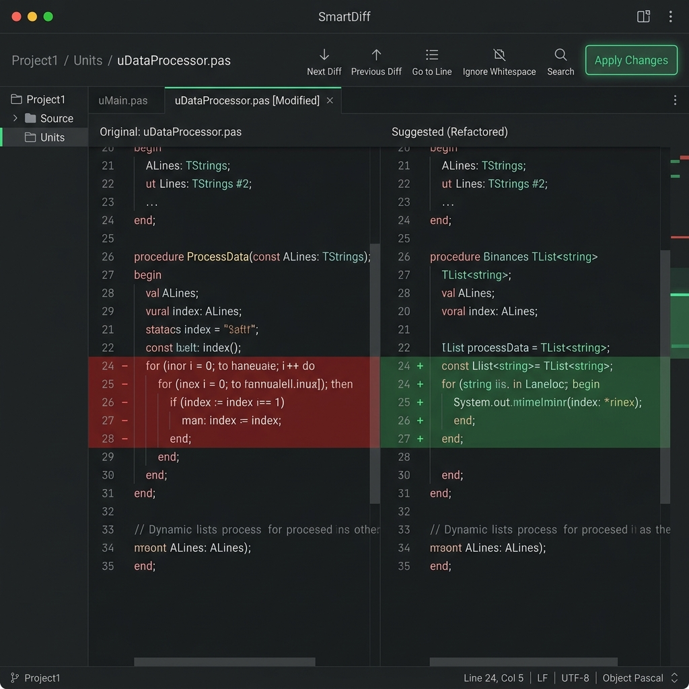

# User Guide: Editor Integration & Code Generation

This guide details how to use **RadIA** features integrated within the Embarcadero Delphi code editor, as well as automatic DTO, documentation, and full-project generation tools.

---

## 1. Context-Aware Editor Actions

RadIA connects natively to the Delphi code editor using the Open Tools API (OTA). You can trigger artificial intelligence analyses for specific code snippets directly inside the editor.

### How to Use:
1. In the IDE code editor, **select** the code block you want to analyze or modify.
2. **Right-click** the selection.
3. At the top of the pop-up menu, open the **RadIA** category and choose one of the following actions:
   * **Explain Selected Code (`/explain`):** Pedagogically analyzes the logic, explaining the execution flow and the purpose of complex algorithms.
   * **Optimize/Refactor (`/refactor`):** Rewrites code aiming for performance, readability, and compliance with Clean Code and SOLID principles.
   * **Find Bugs (`/bugs`):** Scans the code for memory leaks (missing try..finally blocks), unhandled exceptions, and logic flaws.
   * **Generate Unit Tests (`/test`):** Automatically generates structured test classes and methods using the DUnitX framework.

> The **RadIA** submenu is inserted at the top of the editor context menu after the IDE builds its native items, preserving compatibility with Delphi 12/13 and menus added by other plugins.

---

## 2. Smart Visual Diff (Smart Diff)

When you request refactorings or code optimizations, RadIA does not modify your original file immediately. Instead, it presents the suggested changes side-by-side in a premium comparison window.

<p align="center">
  
</p>

### Workflow and How it Works:
* **Side-by-Side View**: The Smart Diff window displays the original code on the left (highlighted in red for deletions) and the suggested AI code on the right (highlighted in green for additions).
* **[Apply Changes] Button**: Clicking this button at the bottom of the Diff panel replaces the targeted code block directly inside the Delphi IDE editor.
* **Safety**: If you decide to discard the changes, simply close the Diff panel. Your original file remains untouched.

---

## 3. Automatic XML Documentation Generation

RadIA allows you to document classes and methods using the standard Delphi XML format, directly feeding the IDE's **Help Insight** feature (which displays documentation tooltips when hovering over methods).

### How to Use:
1. Hover your cursor over a method or property declaration (either in the interface or implementation section).
2. Right-click and choose **RadIA -> Automatic XML Documentation** (or type `/doc` in the chat sidebar).
3. The AI will generate the XML structure and RadIA will insert it right above the targeted method.

### Output Example:
```pascal
/// <summary>
///   Calculates the period sales total by applying discounts and local taxes.
/// </summary>
/// <param name="AStartDate">Apuration start date</param>
/// <param name="AEndDate">Apuration end date</param>
/// <returns>Total calculated amount in current currency</returns>
function CalculatePeriodTotal(const AStartDate, AEndDate: TDateTime): Currency;
```

---

## 4. DTO and Model Converter

Writing Data Transfer Objects (DTOs) or ORM mappings manually from JSON payloads or database tables takes significant time. RadIA automates this.

### How to Use:
1. Paste the JSON payload or SQL DDL script into the chat sidebar.
2. Use the `/dto [format]` slash command (e.g., `/dto vanilla` or `/dto dext`).
3. Supported Formats:
   * **Vanilla Delphi**: Pure Pascal classes with standard getters/setters and properties.
   * **DEXT ORM**: Entity models decorated with attributes ready for the DEXT ORM persistence framework.
   * **TMS Aurelius**: Classes mapped using attributes specific to the TMS Aurelius framework.
   * **REST.Json**: Classes annotated with attributes compatible with Delphi's native JSON serialization framework.

---

## 5. Full-Project Generation via Prompts

One of RadIA's most powerful capabilities is structuring and saving a complete Delphi project from scratch using a simple informal chat prompt.

### How to Use:
1. In the RadIA sidebar chat, request a new project. Example:
   > *"Generate a console project that consumes a weather API and saves the data in local JSON files."*
   *(You can also use the `/createproject` or `/createprojectarch` slash commands for templates adhering to Clean Architecture).*
2. The AI will process the request and return the complete list of structured files (project `.dpr`, configuration `.dproj`, logic units `.pas`, and UI forms `.dfm`).
3. RadIA will display a glassmorphism-styled panel showing the list of generated files.
4. **Saving Workflow**:
   * Click **Criar Projeto e Abrir na IDE** (Create Project and Open in IDE) in the chat UI.
   * A native Windows folder selection dialog will open.

> [!IMPORTANT]
> **Safe Project Generation:**
> For security reasons and to avoid accidentally overwriting existing code, the selected folder for project generation **must be completely empty**. RadIA will block the physical saving process if the chosen directory contains any files.

5. **Loading in the IDE**: Once the files are successfully written, RadIA triggers the Open Tools API and **automatically loads the newly generated project** into the Delphi IDE, ready to compile.
